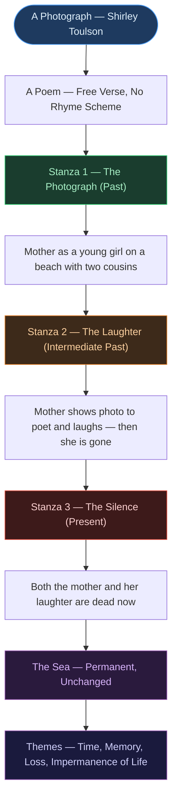

# 📖 CHAPTER 2 — A PHOTOGRAPH
> **Complete Study Notes** | Board · CUET Layered
> *Author: Shirley Toulson | Textbook: Hornbill — Class XI NCERT English Core*

---

## 🗺️ CONCEPT ROADMAP

---

## SECTION 1 — ABOUT THE AUTHOR AND TEXT

### 1.1 Author Profile

> [!info] Shirley Toulson (1924–2018)
> A British poet, travel writer, and author. She wrote extensively about the English countryside, folklore, and personal memory. Her poetry is characterised by its quiet emotional depth, precise imagery, and use of free verse.
>
> *A Photograph* is one of her most anthologised poems — a lyric meditation on memory, time, and grief.

---

### 1.2 Poem Identity

| Feature | Detail |
|:---|:---|
| **Genre** | Lyric poem — personal and meditative |
| **Form** | Free verse — no fixed rhyme scheme or metre |
| **Stanzas** | Three stanzas of unequal length |
| **Tone** | Elegiac, nostalgic, melancholic, quietly resigned |
| **Textbook** | Hornbill — Class XI NCERT English Core |
| **Theme** | Time, memory, loss, impermanence of human life |

> [!important] Key Exam Fact — Free Verse
> The poem is written in **free verse** — it has no regular rhyme scheme or fixed metrical pattern. This is deliberate: free verse mirrors the natural, unstructured movement of memory and grief.

---

## SECTION 2 — THE THREE TIME FRAMES ⭐

> [!important] The Poem's Core Structure — Most Tested Concept
> The entire poem moves across **three distinct time frames**. Understanding these is essential for every type of exam question.

| Time Frame | Who is Alive | What Happens | Stanza |
|:---:|:---:|:---:|:---:|
| **Past 1** — The photograph | Mother (as a girl, ~12 yrs) + Betty + Dolly | Beach photograph taken by "uncle" | Stanza 1 |
| **Past 2** — The laughter | Mother (adult) + Poet (child) | Mother shows photo, laughs; poet observes | Stanza 2 |
| **Present** — The silence | Poet alone | Mother is dead; poet cannot speak | Stanza 3 |

> [!note] The Sea as the Fourth "Time"
> Across all three time frames, the sea remains **unchanged**. It is the poem's anchor — the one constant in a poem about impermanence.

---

## SECTION 3 — STANZA-BY-STANZA ANALYSIS ⭐

### 3.1 Stanza 1 — The Photograph (The Earliest Past)

> [!example] Full Stanza
> *The cardboard shows me how it was*
> *When the two girl cousins went paddling,*
> *Each one holding one of my mother's hands,*
> *And she the big girl — some twelve years or so.*
> *All three stood still to smile for the camera*
> *And the uncle with the camera, I presume,*
> *Was a stranger to them all.*
>
> *Both girls are still paddling, still laughing.*
> *My mother's face, that was before I was born,*
> *Washed by the waves' edge, her sea-washed face.*

**Line-by-line Analysis:**

| Line / Phrase | Analysis |
|:---|:---|
| *"The cardboard shows me how it was"* | The photograph is a physical object — cardboard. It shows the past as a fixed, frozen moment. |
| *"Two girl cousins went paddling"* | The cousins (Betty and Dolly) are identified indirectly here. |
| *"Each one holding one of my mother's hands"* | The mother is the central figure — the bigger, older girl. She holds the cousins. |
| *"She the big girl — some twelve years or so"* | Mother is approximately twelve in the photograph. |
| *"All three stood still to smile for the camera"* | The artificiality of posed photographs — stillness for the camera, not natural stillness. |
| *"The uncle with the camera, I presume"* | The photographer is an uncle — the poet was not present; she can only presume. Distance from the past. |
| *"Was a stranger to them all"* | Irony — a family member who is still a "stranger" to the permanent frozen memory. |
| *"Still paddling, still laughing"* | The present tense "still" — the photograph preserves them mid-action, forever young. |
| *"That was before I was born"* | A moment of time the poet never lived — emphasises the gap between past and present. |
| *"Her sea-washed face"* | Beautiful image — the mother's face, washed and brightened by sea and sun. Freshness of youth. |

---

### 3.2 Stanza 2 — The Laughter (The Intermediate Past)

> [!example] Full Stanza
> *Some twenty-thirty years later*
> *She'd show it me and talk of the past —*
> *Of Dolly who was still alive then*
> *But Betty who had died of a heart attack*
> *Of the beach from their childhood*
> *And I was only twelve, I was a child.*
> *Her laughter was important.*
>
> *Now she's been dead nearly as many years*
> *As that girl in the snapshot was old.*

**Line-by-line Analysis:**

| Line / Phrase | Analysis |
|:---|:---|
| *"Some twenty-thirty years later"* | Vague time reference — memory does not hold precise dates. Mirrors the blurring of time in grief. |
| *"She'd show it me and talk of the past"* | "She'd" (she would) — habitual past tense; a repeated ritual between mother and daughter. |
| *"Of Dolly who was still alive then / But Betty who had died"* | Time is already consuming the people in the photograph even by this second time frame. |
| *"I was only twelve"* | Parallel with the mother being "some twelve years or so" in the photo — deliberate echo. |
| *"Her laughter was important"* | Short, single-sentence stanza break. Emphatic. The laughter was precious — now it is gone. |
| *"Now she's been dead nearly as many years / As that girl in the snapshot was old"* | Powerful parallel: the mother has been dead roughly as long (12 years) as the girl in the photo was old (12 years). Time measuring death against youth. |

> [!warning] Board Exam Trap — "Her laughter was important"
> This is the most quoted and most misread line. Students often write "her laughter was happy." The word **"important"** is deliberate — it conveys that the laughter was a precious, meaningful thing in the poet's life. Now that the mother is dead, it carries the weight of irreplaceable loss.

---

### 3.3 Stanza 3 — The Silence (The Present)

> [!example] Full Stanza
> *Both the people and the sea*
> *Are there for their time,*
> *But for their time only.*
> *And one of the things left over is*
> *The photograph and my grief*
> *And silence silences.*

**Line-by-line Analysis:**

| Line / Phrase | Analysis |
|:---|:---|
| *"Both the people and the sea"* | Surprising inclusion of the sea — even the eternal-seeming sea is temporal. |
| *"Are there for their time, / But for their time only"* | Everything is temporary. People, the sea, joy, laughter — all exist within a span and then are gone. |
| *"One of the things left over is / The photograph and my grief"* | The photograph and grief are the two survivals — material object and emotional residue. |
| *"And silence silences"* | The final line. The most important line in the poem. There are no words adequate for grief. Silence is the only response to such loss. |

> [!important] *"Silence silences"* — Final Line Analysis ⭐
> This is the most significant line in the poem and the most exam-tested.
>
> **Literal meaning:** The poet has fallen silent — she cannot speak.
>
> **Deeper meaning:** Grief is so profound it overwhelms language. The double use of "silence" (as noun and verb) enacts this — the word itself silences the poem. It is a syntactic performance of the theme.
>
> **Poetic device:** Tautology / Self-referential language — the sentence performs what it describes.

---

## SECTION 4 — THEMES ⭐

### 4.1 Primary Themes

| Theme | How it Manifests |
|:---|:---|
| **Impermanence of human life** | People die; the sea remains; even joy is temporary |
| **The passage of time** | Three time frames — each one a further loss |
| **Memory and photography** | A photograph preserves a moment but cannot preserve life |
| **Grief and loss** | The mother's death reduces the poet to silence |
| **The permanence of nature vs transience of humans** | The sea unchanged; the people gone |
| **Loss of the past (personal and shared)** | The laughter, the beach, the cousins — all gone |

---

### 4.2 The Sea as Symbol and Theme

> [!note] The Central Contrast — Sea vs People
> The sea appears in all three stanzas. It is the poem's most important image:
>
> - **Stanza 1:** The sea is the setting — the backdrop to the beach photograph
> - **Stanza 2:** The mother talks of *"the beach from their childhood"* — the sea as memory
> - **Stanza 3:** *"Both the people and the sea / Are there for their time, / But for their time only"*
>
> The twist: the sea, which seemed to be the permanent backdrop, is itself declared temporary. Even the eternal is mortal. This deepens the poem's meditation on impermanence.

---

## SECTION 5 — LITERARY DEVICES ⭐

### 5.1 Devices Used and Their Effects

| Device | Example | Effect |
|:---|:---|:---|
| **Transferred epithet** | *"Transient feet"* | Feet are not transient — the people are. The adjective is transferred from person to body part. |
| **Imagery** | *"Sea-washed face"* | Vivid visual image of the mother's youth — brightness, freshness, sea-spray |
| **Symbolism** | The photograph | Memory, the frozen past, what remains after loss |
| **Symbolism** | The sea | Both permanence and (ironically) impermanence |
| **Irony** | *"The uncle... was a stranger to them all"* | A family member becoming a stranger in memory |
| **Irony** | The sea declared temporary in stanza 3 | The one thing that seemed permanent is also mortal |
| **Alliteration** | *"Stood still to smile"* | Creates a soft, gentle sound effect |
| **Repetition** | *"Still paddling, still laughing"* | "Still" freezes them in the photo — and emphasises what is lost |
| **Parallel structure** | Mother is ~12 in photo; she's been dead ~12 years | Time measuring youth against death |
| **Tautology / Self-reference** | *"Silence silences"* | The sentence enacts the meaning — language collapses under grief |
| **Free verse** | No rhyme scheme | Mirrors the unstructured, natural flow of memory and grief |
| **Enjambment** | Lines run over without pause | Creates flowing, speech-like movement |

---

### 5.2 The Title — Significance

> [!important] Title Analysis
> The title *A Photograph* is deliberately simple and unadorned. The indefinite article "A" (rather than "The") is significant:
>
> - "The photograph" would refer to one specific, known object
> - "A photograph" places it among all photographs — it is universal; any family's photograph could trigger this meditation
>
> The simplicity of the title mirrors the poem's form (free verse) and the directness of grief — there are no ornate words for loss.

---

## SECTION 6 — IMPORTANT LINES WITH ANALYSIS ⭐

| Line | Device | What it Reveals |
|:---|:---:|:---|
| *"The cardboard shows me how it was"* | Imagery | The photograph is a material object — impermanent itself; yet it preserves the past |
| *"She the big girl — some twelve years or so"* | Characterisation | The mother was young, carefree — only childhood in the photo |
| *"Her sea-washed face"* | Imagery / Metaphor | Brightness and freshness of youth — later contrasted with death |
| *"Her laughter was important"* | Understatement | The most emotionally loaded line — "important" is an understatement for irreplaceable |
| *"Now she's been dead nearly as many years / As that girl in the snapshot was old"* | Parallel / Contrast | Time measured against itself — youth and death mirror each other |
| *"Silence silences"* | Tautology | The deepest grief is beyond language — the poem ends where words end |

---

## SECTION 7 — WORKED ANALYSIS (NCERT QUESTIONS)

> [!example] NCERT Q1 — What does the word "cardboard" denote in the poem?
> "Cardboard" denotes the physical, material nature of the photograph — it is a printed image on stiff card. By naming it "cardboard" rather than "photograph," the poet emphasises the object's fragility and ordinariness. It is a simple, perishable object that nonetheless holds an extraordinary moment. The word subtly reminds us that memory's vessels are themselves temporary.

> [!example] NCERT Q2 — What has the camera captured?
> The camera has captured a moment from the mother's childhood — approximately twelve years old, standing at the beach with her two girl cousins (Betty and Dolly), all three paddling and smiling. It has frozen them in a moment of joy and youth that no longer exists. The photograph preserves the past but cannot preserve the people in it.

> [!example] NCERT Q3 — What does "both" in the last stanza refer to?
> "Both" refers to the people (the mother, the cousins) and the sea. The poem expands its meditation in the final stanza — not only are the people temporary, but even the sea that seemed eternal is "there for its time only." This deepens the poem's argument: nothing is permanent, not even what appears to be eternal.

> [!example] NCERT Q4 — What is the meaning of "silence silences"?
> The phrase means that the poet's grief is so profound she has been silenced — there are no words adequate for such loss. The double use of "silence" (as noun and as verb) is a self-referential device: the sentence performs what it describes. It is also the poem's final statement — the poem itself falls silent here, mimicking the poet's state of wordless grief.

---

## QUICK FORMULA REFERENCE

| Topic | Key Answer |
|:---|:---|
| Genre | Lyric poem |
| Form | Free verse (no rhyme scheme) |
| Author | Shirley Toulson (1924–2018) |
| Number of stanzas | Three |
| Number of time frames | Three (Past 1, Past 2, Present) |
| Cousins' names | Betty and Dolly |
| Poet's age in stanza 2 | Twelve years |
| Mother's age in photograph | Approximately twelve years |
| What the sea represents | Permanence (and, ironically, impermanence) |
| Most important final line | *"Silence silences"* |
| Central theme | Impermanence of life; grief and memory |
| Key literary device | Imagery, symbolism (sea, photo), transferred epithet, tautology |
| What "cardboard" denotes | The physical, perishable nature of the photograph |
| What "her laughter was important" means | The laughter was precious and irreplaceable — now lost forever |

---

*End of Core Notes — Ch. 2: A Photograph*
*Exam Tags: CBSE Board · CUET English*
