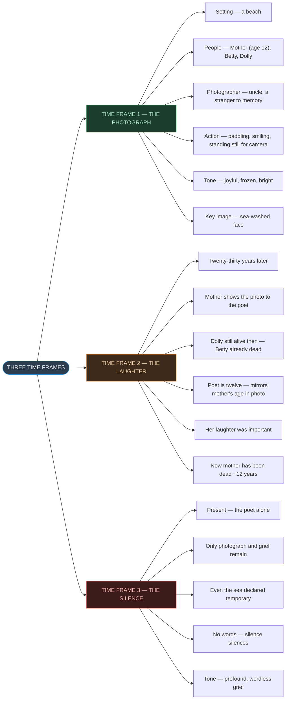
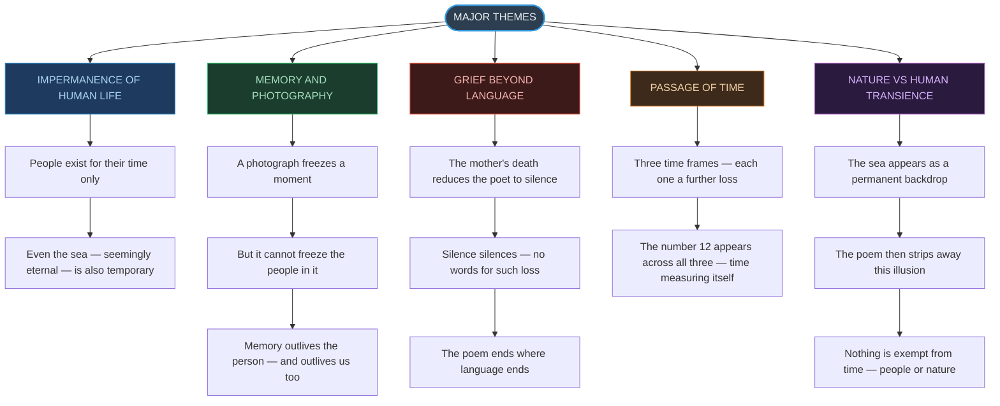
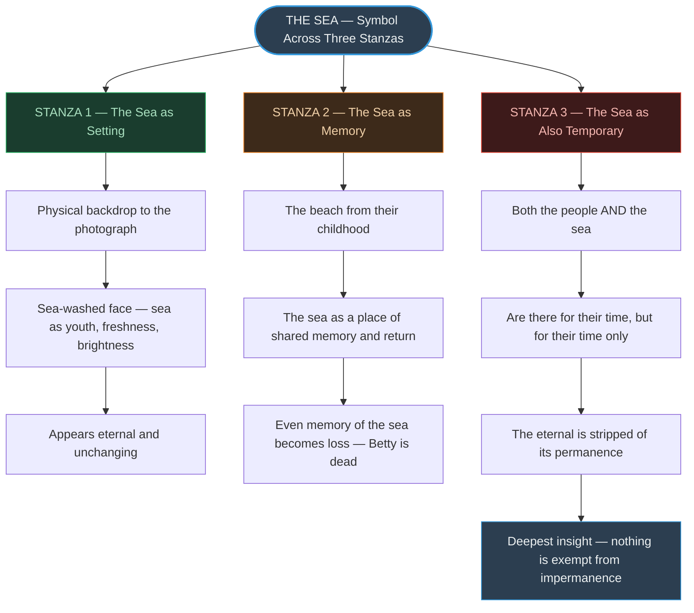

# ⚡ CHAPTER 2 — RAPID REVISION + MIND MAPS
> **A Photograph** | Board · CUET

---

## 📏 Poem Identity — Absolute Must-Memorise

| Feature | Detail | Memory Hook |
|:---|:---:|:---|
| Author | Shirley Toulson | *"ST — Silence and Time"* |
| Genre | Lyric poem | *Personal, meditative, emotional* |
| Form | Free verse | *No rhyme — like memory itself* |
| Stanzas | Three | *Three times = three stanzas* |
| Tone | Elegiac, nostalgic | *Mourning in quiet words* |
| Textbook | Hornbill — Class XI | *Second chapter* |
| Central symbol | The sea | *Permanent yet temporary* |
| Final line | *"Silence silences"* | *Grief beyond language* |

> [!info] **Why free verse?**
> Free verse has no fixed rhyme or metre. It mirrors the **unstructured, organic movement of memory** — grief does not follow a pattern; neither does this poem.

---

## 🔢 The Three Time Frames — Quick Recall ⭐

| Time Frame | Label | Who Is Present | Key Action | Stanza |
|:---:|:---:|:---:|:---:|:---:|
| **Earliest Past** | The Photograph | Mother (~12 yrs) + Betty + Dolly | Paddling on beach, smiling for camera | 1 |
| **Intermediate Past** | The Laughter | Mother (adult) + Poet (~12 yrs) | Mother shows photo, laughs, talks of past | 2 |
| **Present** | The Silence | Poet alone | Mother dead; only photograph and grief remain | 3 |

> [!tip] The Age Echo
> The mother is **~12** in the photograph. The poet is **~12** when her mother shows it to her. The mother has been dead for **~12 years** by the end. The number 12 recurs across all three time frames — binding past, present, and loss together.

---

## 📐 Literary Devices — Know Cold ⭐

| Device | Example from Poem | Effect |
|:---|:---:|:---|
| Transferred epithet | *"Transient feet"* | Feet aren't transient — the people are; adjective transferred |
| Imagery | *"Sea-washed face"* | Vivid freshness of youth — sea-spray brightening the mother's face |
| Symbolism | The photograph | Memory, the frozen past, what survives after loss |
| Symbolism | The sea | Apparent permanence revealed as also temporary |
| Irony | *"Uncle... was a stranger to them all"* | A family member made a stranger by the distance of memory |
| Irony | Sea declared temporary in stanza 3 | The "eternal" backdrop is also mortal |
| Alliteration | *"Stood still to smile"* | Soft, gentle sound — mirrors the stillness of a posed photo |
| Repetition | *"Still paddling, still laughing"* | Freezes them mid-action; emphasises what is lost |
| Tautology | *"Silence silences"* | The sentence performs what it means — language collapses |
| Enjambment | Lines running over | Natural, speech-like flow — mimics thought |
| Parallel structure | Mother ~12 in photo; dead ~12 years | Time measuring youth against death |

---

## ⚠️ Key Lines and Their Meanings — Exam Ready

| Line | Correct Interpretation |
|:---|:---|
| *"The cardboard shows me how it was"* | The photograph is a fragile, material object — its ordinariness contrasts with what it holds |
| *"She the big girl — some twelve years or so"* | Mother is ~12 in the photo — young, carefree; sets up the age parallel |
| *"Uncle... was a stranger to them all"* | Irony — family member yet unknown in memory; we are all strangers to the past |
| *"Still paddling, still laughing"* | Present tense freezes them forever in the photo — and emphasises their subsequent loss |
| *"Her laughter was important"* | **NOT** "her laughter was happy" — "important" = precious, irreplaceable, now gone |
| *"Now she's been dead nearly as many years / As that girl was old"* | ~12 years of death mirrors ~12 years of life in the photo |
| *"Both the people and the sea"* | Even the sea is temporary — nothing is exempt from time |
| *"Silence silences"* | Grief beyond language — the poem performs its own theme |

---

## 🔑 Contrasts in the Poem

| Element | Then (Photograph) | Now (Present) |
|:---:|:---:|:---:|
| The mother | Young, laughing, twelve years old | Dead for ~twelve years |
| The cousins | Paddling, smiling, alive | Betty dead; Dolly alive in stanza 2, status unclear now |
| The laughter | Alive, important, shared | Gone with the mother |
| The sea | Backdrop to joy | Declared also temporary |
| The poet's voice | Observant child, then teenager | Silenced by grief |

---

## ⚡ The Sea — Most Important Symbol

> [!danger] The Sea's Double Role — Always Appears in Exams
> The sea functions differently across the three stanzas:
>
> **Stanza 1:** The sea is the **setting** — background to the beach photograph. It appears permanent.
>
> **Stanza 2:** *"The beach from their childhood"* — the sea as **memory anchor**, the place they return to in thought.
>
> **Stanza 3:** *"Both the people and the sea / Are there for their time, / But for their time only"* — the sea is **declared temporary** too. The poet subverts the expectation of permanence. Even nature, even the sea, exists "for its time only."
>
> This is the poem's deepest insight: nothing is exempt from impermanence — not people, not nature, not memory.

---

# 🗺️ MIND MAP 1 — Chapter Overview

```mermaid
flowchart TD
    ROOT(["A PHOTOGRAPH — Shirley Toulson"])

    ROOT --> TF["THREE TIME FRAMES"]
    ROOT --> TH["THEMES"]
    ROOT --> LD["LITERARY DEVICES"]
    ROOT --> SY["KEY SYMBOLS"]
    ROOT --> ST["STANZA STRUCTURE"]

    TF --> T1["Past 1 — Photograph — Mother as girl on beach"]
    TF --> T2["Past 2 — Laughter — Mother shows photo, poet watches"]
    TF --> T3["Present — Silence — Mother dead, poet speechless"]

    TH --> TH1["Impermanence of human life"]
    TH --> TH2["Time and memory"]
    TH --> TH3["Grief beyond language"]
    TH --> TH4["Nature vs human transience"]

    LD --> LD1["Transferred epithet — transient feet"]
    LD --> LD2["Imagery — sea-washed face"]
    LD --> LD3["Tautology — silence silences"]
    LD --> LD4["Irony — uncle a stranger, sea also temporary"]
    LD --> LD5["Free verse — no rhyme scheme"]

    SY --> SY1["The photograph — frozen past, material memory"]
    SY --> SY2["The sea — apparent permanence, actual impermanence"]
    SY --> SY3["The cardboard — fragile vessel of memory"]
    SY --> SY4["Laughter — precious, irreplaceable, now lost"]

    ST --> ST1["Stanza 1 — Descriptive, past-tense photograph"]
    ST --> ST2["Stanza 2 — Memory, laughter, time passing"]
    ST --> ST3["Stanza 3 — Present grief, silence, no answer"]

    style ROOT fill:#2c3e50,color:#ecf0f1,stroke:#3498db,stroke-width:2px
    style TF fill:#1e3a5f,color:#aed6f1,stroke:#2980b9
    style TH fill:#1a3d2e,color:#a9dfbf,stroke:#27ae60
    style LD fill:#3d2a1a,color:#f0d0a8,stroke:#e67e22
    style SY fill:#2a1a3d,color:#d8b4fe,stroke:#9b59b6
    style ST fill:#3d1a1a,color:#f5b7b1,stroke:#e74c3c
```

---

# 🗺️ MIND MAP 2 — The Three Time Frames

---

# 🗺️ MIND MAP 3 — Literary Devices Tree

```mermaid
flowchart TD
    ROOT(["LITERARY DEVICES IN THE POEM"])

    ROOT --> IMG["IMAGERY"]
    IMG --> IMG1["Sea-washed face — youth, brightness, freshness"]
    IMG --> IMG2["Cardboard — material fragility of memory"]
    IMG --> IMG3["Paddling — physical joy of childhood"]

    ROOT --> SYM["SYMBOLISM"]
    SYM --> SYM1["The photograph — frozen past, material memory"]
    SYM --> SYM2["The sea — impermanence disguised as permanence"]

    ROOT --> IRO["IRONY"]
    IRO --> IRO1["Uncle was a stranger to them all — family yet unknown"]
    IRO2["Sea declared temporary — the eternal is also mortal"]
    IRO --> IRO2

    ROOT --> TE["TRANSFERRED EPITHET"]
    TE --> TE1["Transient feet — transience belongs to the people, not the feet"]

    ROOT --> TAU["TAUTOLOGY"]
    TAU --> TAU1["Silence silences — language performs its own collapse"]

    ROOT --> FV["FREE VERSE and ENJAMBMENT"]
    FV --> FV1["No rhyme — mirrors unstructured grief"]
    FV --> FV2["Enjambment — natural, flowing movement of thought"]

    ROOT --> PAR["PARALLEL STRUCTURE"]
    PAR --> PAR1["Mother ~12 in photo — poet ~12 watching — mother dead ~12 years"]
    PAR --> PAR2["Three twelves binding all three time frames together"]

    style ROOT fill:#2c3e50,color:#ecf0f1,stroke:#3498db,stroke-width:2px
    style IMG fill:#1e3a5f,color:#aed6f1,stroke:#3498db
    style SYM fill:#2a1a3d,color:#d8b4fe,stroke:#9b59b6
    style IRO fill:#3d2a1a,color:#f0d0a8,stroke:#e67e22
    style TE fill:#1a3d2e,color:#a9dfbf,stroke:#27ae60
    style TAU fill:#3d1a1a,color:#f5b7b1,stroke:#e74c3c
    style PAR fill:#1a2a3d,color:#aed6f1,stroke:#3498db
```

---

# 🗺️ MIND MAP 4 — Themes Tree

---

# 🗺️ MIND MAP 5 — The Sea Across All Three Stanzas

---

# 🗺️ MIND MAP 6 — Final Line Analysis

```mermaid
flowchart TD
    ROOT(["SILENCE SILENCES — Final Line"])

    ROOT --> L["LITERAL MEANING"]
    L --> L1["The poet has fallen silent"]
    L --> L2["She cannot find words for her grief"]

    ROOT --> D["DEEPER MEANING"]
    D --> D1["Grief is so profound it overwhelms language"]
    D --> D2["No words are adequate for the loss of a mother"]

    ROOT --> P["POETIC DEVICE"]
    P --> P1["Tautology — noun and verb form of the same word"]
    P --> P2["Self-referential — the sentence performs what it describes"]
    P --> P3["The poem ends where language ends"]

    ROOT --> T["THEMATIC SIGNIFICANCE"]
    T --> T1["Connects to the poem's central theme — impermanence"]
    T --> T2["Just as the mother could not last, words cannot last"]
    T --> T3["Only silence and grief are left — along with the photograph"]

    style ROOT fill:#2c3e50,color:#ecf0f1,stroke:#3498db,stroke-width:2px
    style L fill:#1a3d2e,color:#a9dfbf,stroke:#27ae60
    style D fill:#1e3a5f,color:#aed6f1,stroke:#3498db
    style P fill:#3d2a1a,color:#f0d0a8,stroke:#e67e22
    style T fill:#3d1a1a,color:#f5b7b1,stroke:#e74c3c
```

---

### Quick-Reference Contrast Table

| Element | In the Photograph (Past 1) | When Shown (Past 2) | Now (Present) |
|:---:|:---:|:---:|:---:|
| **Mother** | ~12, laughing, alive | Adult, laughing, alive | Dead for ~12 years |
| **Betty** | Alive, paddling | Dead | Dead |
| **Dolly** | Alive, paddling | Alive | Unknown |
| **The sea** | Backdrop, setting | Memory | Declared temporary |
| **The poet** | Not yet born | ~12 years old, observing | Silent, grieving |
| **Tone** | Joyful | Nostalgic, warm | Silenced, elegiac |

---

*End of Rapid Revision + Mind Maps — Ch. 2: A Photograph*
*Exam Tags: CBSE Board · CUET English*
