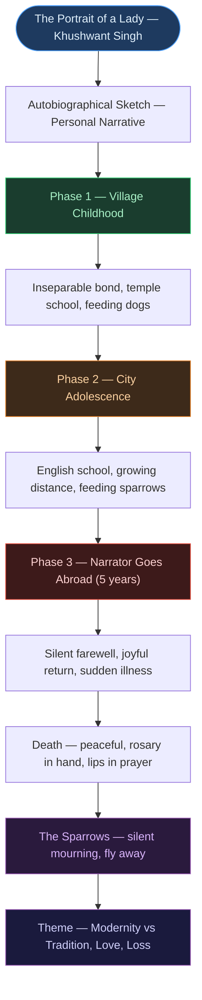

# 📖 CHAPTER 1 — THE PORTRAIT OF A LADY
> **Complete Study Notes** | Board · CUET Layered
> *Author: Khushwant Singh | Textbook: Hornbill — Class XI NCERT English Core*

---

## 🗺️ CONCEPT ROADMAP

---

## SECTION 1 — ABOUT THE AUTHOR AND TEXT

### 1.1 Author Profile

> [!info] Khushwant Singh (1915–2014)
> One of India's most celebrated authors, journalists, and public intellectuals. Known for wit, candour, and humanist storytelling. Major works include *Train to Pakistan* and *The History of the Sikhs*.
>
> *The Portrait of a Lady* is an **autobiographical sketch** — written from the first-person perspective of the author himself.

---

### 1.2 Genre and Form

| Feature | Detail |
|:---|:---|
| **Genre** | Autobiographical sketch / Prose |
| **Narrative mode** | First person (narrator = author) |
| **Tone** | Tender, nostalgic, reflective |
| **Style** | Simple, imagistic, layered with symbolism |
| **Textbook** | Hornbill — Class XI NCERT English Core |

> [!important] Key Exam Fact
> The story is **not fiction** — it is the author's actual recollection of his grandmother. This makes it an autobiographical sketch, not a short story.

---

## SECTION 2 — CHARACTERS

### 2.1 The Grandmother ⭐

> [!important] Central Character — Most Tested in Exams
> The moral and emotional heart of the story. Every major theme flows through her characterisation.

| Trait | Evidence from Text |
|:---|:---|
| **Deeply religious** | Always telling beads of rosary, lips moving in silent prayer |
| **Selfless** | Never demands attention; gives without expecting |
| **Dignified** | Never weeps, never reproaches narrator |
| **Compassionate** | Feeds stray dogs (village); feeds sparrows (city) |
| **Accepting** | Embraces change without bitterness or complaint |
| **Traditional** | Disturbed by music in school; rooted in faith |

---

### 2.2 The Narrator (Khushwant Singh)

> [!note] The Narrator's Role
> The narrator is the author himself — observant, affectionate in childhood, later emotionally distant due to education and geography. He is the lens through which the reader sees the grandmother.

---

### 2.3 The Sparrows — Symbolic Characters

> [!tip] Do Not Overlook the Sparrows — Frequently Tested
> The sparrows are not merely background detail. They function as symbolic characters:
> - Companions to the grandmother in her city solitude
> - Their **silence** at her death is the story's most powerful image
> - They refuse bread and fly away quietly — wordless grief

---

## SECTION 3 — THE THREE PHASES ⭐

### 3.1 Phase 1 — Village Childhood

> [!example] Setting and Bond
> The narrator grows up with his grandmother in the village. Their bond is intimate and daily.

**Key details of this phase:**

| Detail | Significance |
|:---|:---|
| She wakes him, bathes him every morning | Shows her central role in his daily life |
| Walks him to the village school | Inseparable companionship |
| School is attached to the temple | Religion and education unified — she can relate |
| She reads scriptures while he studies | Parallel devotion — physical closeness |
| Feeds stale bread to stray dogs on return | Daily act of compassion; first animal-feeding motif |

> [!note] Physical Description (Phase 1)
> The grandmother is described as *"old, wrinkled, white-haired, slightly bent."* She is *"like the winter landscape in the mountains, beautiful and stark."* Her lips are always moving in silent prayer; her fingers always on the rosary.

---

### 3.2 Phase 2 — City Life and Growing Distance ⭐

> [!example] The Turning Point
> The family moves to the city. The narrator and his grandmother continue living together but the relationship changes fundamentally.

**The key shift:**

| Before — Village | After — City |
|:---|:---|
| Walked him to school every day | He takes the bus alone |
| Temple school — she could follow | English school — science, music — alien to her |
| Education and faith united | Modern curriculum disconnects them |
| Fed dogs on the way home | Feeds sparrows in the courtyard |
| Constant companionship | She retreats to her room, spinning wheel, prayer |

> [!important] The Music Controversy — Frequently Asked
> The grandmother is **disturbed** by music being taught in the city school. She believed music was associated with *"dancing girls and the riff-raff"* — morally unrefined company, unsuitable for a decent young man. This reveals her deep traditionalism and her fear of cultural change.

> [!warning] Board Exam Trap
> Students often say the grandmother was "angry." The correct word is **"disturbed"** or **"troubled"** — she does not express anger outwardly. Her response is withdrawal and prayer, not confrontation.

---

### 3.3 Phase 3 — Narrator Goes Abroad and Returns

> [!example] Five Years of Separation
> The narrator leaves for abroad to study. This is the longest physical separation.

**The farewell:**
- She comes to the railway station to see him off
- She does **not weep** or make a scene
- She holds him and moves her lips in silent prayer, rosary in her fingers
- The narrator senses she fears this may be their **last meeting**

**On his return after five years:**

| Action | Significance |
|:---|:---|
| Gathers neighbourhood women | Steps out of solitude — rare social act |
| Sings old folk songs of warriors returning | Celebrates his return with joy |
| Plays the **drum** | Completely out of character — the one burst of exuberance |
| Falls ill with fever that evening | The burst of energy takes its toll |

> [!important] The Drumming Scene — Most Discussed in Class
> The grandmother singing and playing the drum is the **single time** she steps outside her usual composed, quiet character. It makes her death the following day all the more poignant — it was her final act of joy.

---

### 3.4 The Final Hours and Death

> [!example] A Dignified End
> - She develops a mild fever that evening
> - She **refuses to rest** or talk — says she does not want to waste her last hours
> - She lies on her bed, continuing to pray on her rosary
> - Her lips keep moving until the very end
> - The **rosary slips from her fingers** — prayer and life end simultaneously

> [!tip] Exam Significance of the Death Scene
> The death is notable for its complete **absence of drama**. There is no weeping, no last words, no climactic speech. This is the author's deliberate choice — it mirrors how the grandmother lived: quietly, spiritually, on her own terms.

---

### 3.5 The Sparrows' Farewell ⭐

> [!important] The Most Symbolically Rich Scene — Always Appears in Exams
> - Thousands of sparrows gather silently around her body
> - They do **not chirp**
> - They do **not eat** the bread laid out for them
> - When the body is taken away, they fly off quietly
>
> This scene elevates the story from memoir to something approaching poetry. It is the author's way of showing that the grandmother's love extended beyond human relationships — even creatures mourned her.

---

## SECTION 4 — THEMES ⭐

### 4.1 Primary Themes

| Theme | How it Manifests in the Story |
|:---|:---|
| **Passage of time** | Three phases mark irreversible change in the bond |
| **Modernity vs tradition** | English education disconnects narrator from grandmother's world |
| **Love without words** | Grandmother never says "I love you" — her love is expressed through acts |
| **Faith and devotion** | Prayer is not occasional — it is the architecture of her existence |
| **Loss and separation** | Each phase increases distance; modernity has a human cost |
| **Nature and compassion** | Her bond with animals (dogs, sparrows) mirrors her bond with people |

---

### 4.2 The Central Tension

> [!note] Modernity vs Tradition — The Core Conflict
> Every step of the narrator's education adds distance from his grandmother — not through ill will but because their worlds are growing irreconcilably different:
>
> - Village temple school → unified faith and learning — **she belonged**
> - City English school → science, music, Western curriculum — **she was excluded**
> - Abroad → five years, a different continent — **she was left behind**
>
> The story argues that modernisation, while expanding the world for the young, can leave the old isolated and behind.

---

## SECTION 5 — LITERARY DEVICES ⭐

### 5.1 Devices Used and Their Effects

| Device | Example from Text | Effect |
|:---|:---|:---|
| **Simile** | *"Like the winter landscape in the mountains, beautiful and stark"* | Conveys austere, timeless, dignified beauty |
| **Simile** | *"Her face almost white as the white dressing-gown she wore"* | Exaggerates shock/fear; intensifies emotion |
| **Symbolism** | The rosary | Faith, identity, prayer — it slips from her fingers at death |
| **Symbolism** | The sparrows | Life, devotion, silent grief |
| **Symbolism** | The spinning wheel | Tradition, patience, timeless routine |
| **Irony** | The title | Painted portrait = impersonal; the written story = real portrait |
| **Imagery** | *"Lips moving in silent prayer"* | Inward spirituality; prayer as constant state of being |
| **Contrast** | Village school vs city school | Traditional vs modern; unity vs division |
| **Foreshadowing** | Her silence at departure; sensing last meeting | Prepares reader for her death |
| **Polysyndeton** | Multiple "ands" in a sentence | Creates pace, mimics rapid action |

---

### 5.2 The Title — Significance ⭐

> [!important] Title Analysis — Appears in Almost Every Exam
> The title works on **two levels**:
>
> **Literal:** There is an actual painted portrait of the grandmother hanging in the house — the narrator describes it as "impersonal." It shows an old woman but captures nothing of her soul.
>
> **Metaphorical/Ironic:** The entire story is itself the real portrait — intimate, warm, detailed, full of the living woman the narrator actually knew.
>
> The irony: a painted portrait, however accurate, is lifeless. The written portrait — Singh's own essay — is the only one that truly captures her.

---

## SECTION 6 — IMPORTANT QUOTES WITH ANALYSIS ⭐

| Quote | Analysis |
|:---|:---|
| *"She was beautiful... like the winter landscape in the mountains, beautiful and stark."* | Simile establishing austere, ageless, dignified beauty; sets the tone of reverence |
| *"She accepted her seclusion with resignation."* | Shows selflessness and spiritual maturity — no bitterness |
| *"She said it was not proper for school boys to learn music."* | Reveals traditionalism and moral conservatism |
| *"She came to say goodbye... her lips moved in prayer."* | Composure and inwardness; acceptance without resentment |
| *"There was no chirping."* | Most powerful line — silence as deepest mourning; sparrows grieve |
| *"The rosary... slipped from her fingers."* | Perfect symbol — prayer and life end simultaneously |

---

## SECTION 7 — WORKED ANALYSIS (NCERT QUESTIONS)

> [!example] NCERT Q1 — Explain with examples the significance of the portrait
> The portrait hanging in the house is "impersonal" — it captures appearance but not character. The actual story is the real portrait: it shows her faith through the rosary, her compassion through the animals she fed, her love through the acts she performed. A painted portrait freezes a moment; Singh's written portrait captures a life.

> [!example] NCERT Q2 — The three phases of the narrator's relationship
> **Phase 1 (Village):** Intimate, daily, shared. She walked him to school; education and religion were unified; she could participate fully.
> **Phase 2 (City):** Distance begins. He travels alone; she cannot follow English education or accept music lessons; she retreats to prayer and sparrows.
> **Phase 3 (Abroad):** Complete physical separation for five years. She accepts it silently. On return, she celebrates once — then dies.

> [!example] NCERT Q3 — What does the author mean by the "thread of their relationship was strained"?
> The "thread" metaphor suggests the bond still existed but had become thin and fragile. In the village it was a thick rope — shared daily life. In the city, modern education pulled them apart intellectually and socially. The thread did not break (love persisted) but it was stretched thin by incompatibility of their worlds.

---

## QUICK FORMULA REFERENCE

| Topic | Key Answer |
|:---|:---|
| Genre | Autobiographical sketch |
| Author | Khushwant Singh (1915–2014) |
| Number of phases | Three |
| Animal — village | Stray dogs |
| Animal — city | Sparrows |
| Duration abroad | Five years |
| Grandmother's last act | Praying on the rosary |
| Most symbolic scene | Sparrows refusing bread; flying away silently |
| Title irony | Painted portrait = impersonal; story = real portrait |
| Central theme | Modernity vs tradition; erosion of family bonds |
| Key literary device | Simile (winter landscape), Symbolism (sparrows, rosary) |

---

*End of Core Notes — Ch. 1: The Portrait of a Lady*
*Exam Tags: CBSE Board · CUET English*
