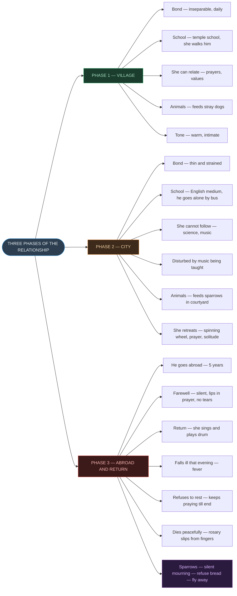
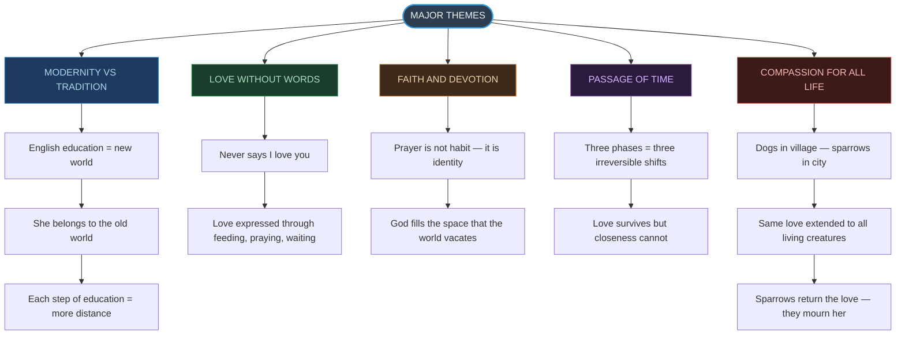
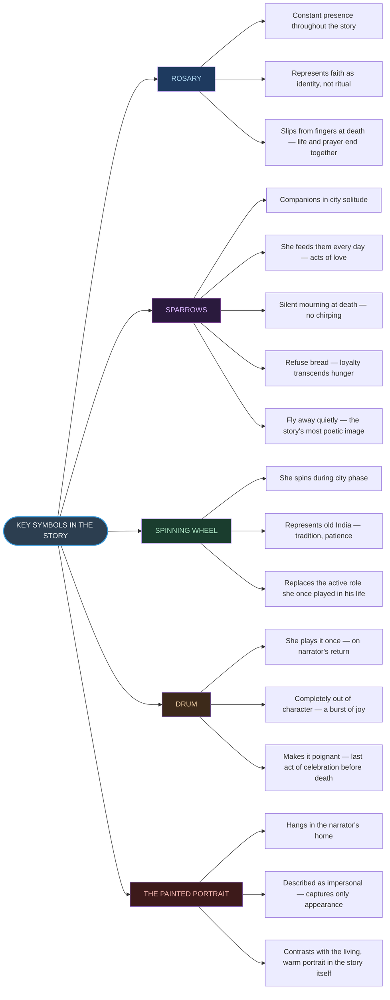
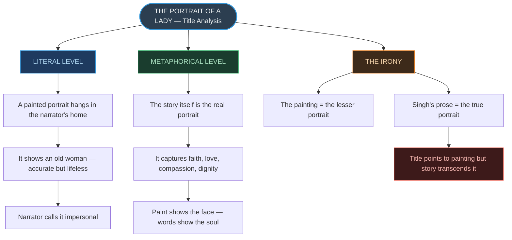

# ⚡ CHAPTER 1 — RAPID REVISION + MIND MAPS
> **The Portrait of a Lady** | Board · CUET

---

## 📏 Story Identity — Absolute Must-Memorise

| Feature | Detail | Memory Hook |
|:---|:---:|:---|
| Author | Khushwant Singh | *"KS — Kind and Sensitive"* |
| Genre | Autobiographical sketch | *Not fiction — it's real* |
| Textbook | Hornbill — Class XI | *First chapter, first impression* |
| Tone | Nostalgic, tender | *Memory, not drama* |
| Narrator | First person (= author) | *"I" = Khushwant himself* |
| Central figure | The Grandmother | *Portrait subject* |
| Key symbol | Sparrows | *Silence = deepest grief* |

> [!info] **What makes this an "autobiographical sketch" and not a "short story"?**
> The events are **real**, the narrator is the **author himself**, and the purpose is **personal recollection** rather than invented plot.

---

## 🔢 The Three Phases — Quick Recall ⭐

| Phase | Setting | Bond Status | Grandmother's Activity |
|:---:|:---:|:---:|:---|
| **1** | Village — Childhood | Inseparable | Walks him to temple school; feeds dogs |
| **2** | City — Adolescence | Growing distant | Retreats to prayer + spinning wheel; feeds sparrows |
| **3** | Abroad — 5 years away | Physical separation | Silent farewell; joyful return; death |

> [!tip] Calculation Shortcut
> **Phase 1** = religious unity | **Phase 2** = religious solitude | **Phase 3** = spiritual completion

---

## 📐 Literary Devices — Know Cold ⭐

| Device | Example | Effect |
|:---|:---:|:---|
| Simile | *"Like the winter landscape... beautiful and stark"* | Timeless, austere beauty |
| Simile | *"Face white as the white dressing-gown"* | Exaggerates shock/emotion |
| Symbolism | Rosary | Faith, prayer, identity |
| Symbolism | Sparrows | Devotion, grief, loyalty |
| Symbolism | Spinning wheel | Tradition, patience |
| Irony | The title | Story = real portrait; painting = impersonal |
| Foreshadowing | She senses last meeting at departure | Prepares reader for death |
| Contrast | Village school vs city school | Tradition vs modernity |
| Imagery | *"Lips moving in silent prayer"* | Constant inward spirituality |

---

## ⚠️ Important Contrasts — Village vs City

| Aspect | Village | City |
|:---:|:---:|:---:|
| School type | Temple school | English medium school |
| How he got there | She walked him | He took the bus alone |
| Could she help? | ✅ Yes — prayers, values | ❌ No — science, music |
| Animal she fed | Stray dogs | Sparrows |
| Their bond | Inseparable | Strained and thin |
| Her spiritual life | Integrated in their daily routine | Retreated to private room |

---

## 🔑 Key Quotes — Exam Ready

| Quote | Device | What it Reveals |
|:---|:---:|:---|
| *"Beautiful and stark — like the winter landscape"* | Simile | Austere, ageless, dignified beauty |
| *"Accepted her seclusion with resignation"* | Word choice | Selflessness, no bitterness |
| *"Not proper for school boys to learn music"* | Dialogue | Traditionalism, moral conservatism |
| *"Lips moved in prayer"* at farewell | Imagery | Acceptance, inward strength |
| *"There was no chirping"* | Symbolism | Sparrows grieve; silence = deepest mourning |
| *"The rosary slipped from her fingers"* | Symbolism | Prayer and life end simultaneously |

---

## ⚡ Title Analysis — Always Asked

> [!danger] The Irony of the Title — Critical for Board
> **"Portrait of a Lady"** operates on two levels:
>
> **Literal:** A painted portrait of the grandmother hangs in the narrator's home. He describes it as "impersonal" — it captures only her appearance.
>
> **Ironic/Metaphorical:** The **written story itself** is the real portrait — it captures her faith, her love for animals, her compassion, her quiet heroism. Paint cannot do what words can.
>
> The title is deliberately ironic: the actual painting is the lesser portrait; Singh's prose is the true one.

---

# 🗺️ MIND MAP 1 — Chapter Overview

```mermaid
flowchart TD
    ROOT(["THE PORTRAIT OF A LADY — Khushwant Singh"])

    ROOT --> PH["THREE PHASES"]
    ROOT --> CH["CHARACTERS"]
    ROOT --> TH["THEMES"]
    ROOT --> LD["LITERARY DEVICES"]
    ROOT --> SY["KEY SYMBOLS"]

    PH --> P1["Phase 1 — Village — Inseparable bond"]
    PH --> P2["Phase 2 — City — Growing distance"]
    PH --> P3["Phase 3 — Abroad then death"]

    CH --> C1["Grandmother — faith, selflessness, dignity"]
    CH --> C2["Narrator — observer, later emotionally distant"]
    CH --> C3["Sparrows — silent grief, loyalty"]

    TH --> T1["Modernity vs Tradition"]
    TH --> T2["Love expressed through acts not words"]
    TH --> T3["Faith and devotion as way of life"]
    TH --> T4["Time and irreversible change"]

    LD --> L1["Simile — winter landscape"]
    LD --> L2["Symbolism — rosary, sparrows, wheel"]
    LD --> L3["Irony — title"]
    LD --> L4["Contrast — village vs city school"]

    SY --> S1["Rosary — prayer, identity, lifeline"]
    SY --> S2["Sparrows — companionship, mourning"]
    SY --> S3["Spinning wheel — tradition, acceptance"]
    SY --> S4["Drum — the one burst of joy; poignant"]

    style ROOT fill:#2c3e50,color:#ecf0f1,stroke:#3498db,stroke-width:2px
    style PH fill:#1e3a5f,color:#aed6f1,stroke:#2980b9
    style TH fill:#1a3d2e,color:#a9dfbf,stroke:#27ae60
    style LD fill:#3d2a1a,color:#f0d0a8,stroke:#e67e22
    style SY fill:#2a1a3d,color:#d8b4fe,stroke:#9b59b6
    style CH fill:#3d1a1a,color:#f5b7b1,stroke:#e74c3c
```

---

# 🗺️ MIND MAP 2 — The Three Phases

---

# 🗺️ MIND MAP 3 — Grandmother's Character

```mermaid
flowchart TD
    ROOT(["THE GRANDMOTHER — Character Map"])

    ROOT --> APP["APPEARANCE"]
    ROOT --> QUAL["QUALITIES"]
    ROOT --> ACT["ACTIONS THAT REVEAL CHARACTER"]
    ROOT --> END["HER END"]

    APP --> A1["Old, short, slightly bent"]
    APP --> A2["White hair, wrinkled face"]
    APP --> A3["Lips always moving in silent prayer"]
    APP --> A4["Fingers always on the rosary"]
    APP --> A5["Like the winter landscape — stark but beautiful"]

    QUAL --> Q1["Deeply religious — prayer is her life"]
    QUAL --> Q2["Selfless — gives, never demands"]
    QUAL --> Q3["Dignified — no weeping, no reproach"]
    QUAL --> Q4["Compassionate — loves animals as she loves people"]
    QUAL --> Q5["Accepting — no bitterness about being left behind"]
    QUAL --> Q6["Traditional — disturbed by modern music in schools"]

    ACT --> AC1["Feeds dogs daily in village"]
    ACT --> AC2["Feeds sparrows daily in city"]
    ACT --> AC3["Silent prayer at narrator's departure"]
    ACT --> AC4["Sings and plays drum on his return"]
    ACT --> AC5["Refuses to rest on final day — keeps praying"]

    END --> E1["Lies down, continues prayer on rosary"]
    END --> E2["Lips move until the very end"]
    END --> E3["Rosary slips from fingers — death comes peacefully"]
    END --> E4["Sparrows mourn silently"]

    style ROOT fill:#2c3e50,color:#ecf0f1,stroke:#3498db,stroke-width:2px
    style QUAL fill:#1a3d2e,color:#a9dfbf,stroke:#27ae60
    style ACT fill:#1e3a5f,color:#aed6f1,stroke:#3498db
    style END fill:#3d1a1a,color:#f5b7b1,stroke:#e74c3c
    style APP fill:#3d2a1a,color:#f0d0a8,stroke:#e67e22
```

---

# 🗺️ MIND MAP 4 — Themes Tree

---

# 🗺️ MIND MAP 5 — Symbols and Their Meanings

---

# 🗺️ MIND MAP 6 — Title and Irony

---

### Quick-Reference Contrast Table

| Dimension | Village Phase | City Phase |
|:---:|:---:|:---:|
| **Bond** | Inseparable | Strained |
| **School** | Temple school | English medium |
| **She accompanied him?** | ✅ Daily | ❌ He went alone |
| **Education she understood?** | ✅ Prayers, values | ❌ Science, music |
| **Animals she fed** | Stray dogs | Sparrows |
| **Her spiritual life** | Shared with him | Private and solitary |

---

*End of Rapid Revision + Mind Maps — Ch. 1: The Portrait of a Lady*
*Exam Tags: CBSE Board · CUET English*
