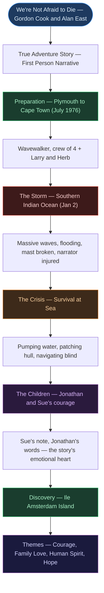

# 📖 CHAPTER 3 — WE'RE NOT AFRAID TO DIE... IF WE CAN ALL BE TOGETHER
> **Complete Study Notes** | Board · CUET Layered
> *Authors: Gordon Cook and Alan East | Textbook: Hornbill — Class XI NCERT English Core*

---

## 🗺️ CONCEPT ROADMAP

---

## SECTION 1 — ABOUT THE TEXT

### 1.1 Author and Context

> [!info] Gordon Cook and Alan East
> *We're Not Afraid to Die...* is based on the **real experience** of Gordon Cook, who undertook a round-the-world voyage in 1976–77 with his family. Alan East co-wrote the account. It was first published in *Reader's Digest* and later included in NCERT Hornbill as a narrative of extraordinary human courage.

---

### 1.2 Text Identity

| Feature | Detail |
|:---|:---|
| **Genre** | True adventure narrative / First-person prose |
| **Narrative mode** | First person (narrator = the father/Gordon Cook) |
| **Tone** | Tense, determined, quietly heroic; tender at the human moments |
| **Setting** | Southern Indian Ocean, January 1977 |
| **Textbook** | Hornbill — Class XI NCERT English Core |
| **Theme** | Courage, family love, survival, determination, hope |

> [!important] Key Exam Fact
> This is a **true story** — not fiction. The narrator is the author himself. This makes it a first-person narrative non-fiction account, not a short story.

---

## SECTION 2 — CHARACTERS ⭐

### 2.1 The Narrator (The Father / Gordon Cook)

> [!important] Central Character
> The narrator is the father and captain of the Wavewalker. He is the story's anchor — physically injured, mentally under enormous pressure, yet he keeps the family alive through seamanship, endurance, and sheer determination.

| Quality | Evidence |
|:---|:---|
| **Skilled sailor** | Had spent 16 years preparing; expert navigator |
| **Physically courageous** | Works through broken ribs, missing teeth, severe injuries |
| **Calm under pressure** | Does not reveal the full extent of danger to protect family |
| **Devoted father** | Moved to tears by Sue's note and Jonathan's words |
| **Precise and methodical** | Navigates to within 10 miles of Ile Amsterdam using dead reckoning |

---

### 2.2 Mary (The Wife)

> [!note] Mary's Role — Frequently Underestimated in Exam Answers
> Mary is quiet but essential. She:
> - Stands at the helm in the storm, steering for hours
> - Pumps water continuously alongside the crew
> - Does not panic or break down
> - Her **steadiness** is the family's second anchor after the narrator
>
> *Board tip: Do not describe Mary as merely "supportive." She is actively heroic.*

---

### 2.3 Jonathan (Son, 6 years old) ⭐

> [!important] Jonathan — Most Exam-Tested Character After the Narrator
> Jonathan is six years old during the storm. He is injured (bump on the head) but:
> - Never cries
> - Asks cheerful, practical questions
> - Gives the story its title: *"We're not afraid to die, if we can all be together"*
>
> His words are the emotional climax of the story — a six-year-old's acceptance of death, conditioned entirely on being together as a family.

---

### 2.4 Suzanne / Sue (Daughter, 7 years old) ⭐

> [!important] Sue — Most Emotionally Significant Character
> Sue is seven years old. She is seriously injured — a black eye, a severely swollen and bruised cheek, and what the narrator later discovers are cracked ribs and torn skin. Yet she:
> - Does not tell her father about her injuries during the crisis
> - Writes him a note: *"Dear Daddy, I love you. You are the best daddy in the world and the best captain."*
> - Draws pictures of their adventure to cheer him up
>
> This selfless act — a severely injured child reassuring her father — is the story's most moving moment.

---

### 2.5 Larry Vigil and Herb Seigler

> [!note] The Professional Crewmen
> Picked up in Cape Town, South Africa. Both are experienced sailors. During the storm, they pump water almost continuously — a physically exhausting, critical task that keeps the boat afloat. They represent professional skill and quiet heroism.

---

## SECTION 3 — THE JOURNEY — PHASE BY PHASE ⭐

### 3.1 The Preparation and Early Voyage

> [!example] Setting Out
> The narrator had spent **16 years** dreaming of and preparing for this voyage — to replicate the journey of Captain James Cook around the world. They set sail from **Plymouth, England in July 1976** on their professionally built 23-metre wooden-hulled vessel, **Wavewalker**.
>
> The first leg of the journey — to Cape Town, South Africa — was smooth. In Cape Town they picked up **Larry and Herb** as additional crew. They then headed south-east into the southern Indian Ocean, toward Australia.

---

### 3.2 The Storm — January 2 ⭐

> [!example] The Crisis Begins
> On **2 January**, near the southern Indian Ocean, they encountered a massive storm. Waves reached **15 metres** — as tall as a five-storey building.

**The sequence of events during the storm:**

| Event | Detail |
|:---|:---|
| Massive wave strikes | 40-kilometre-per-hour winds; the boat is flung onto its side |
| Water floods the cabin | Thousands of litres pour in |
| The narrator is swept overboard | He grabs a rope and is pulled back on deck |
| The narrator is severely injured | Broken ribs, missing teeth, injuries to hands and head |
| The mast and sails are damaged | The boat loses much of its sailing capability |
| The hull is cracking | Water pours through the damaged planks |
| Mary takes the helm | She steers through the storm for hours |
| Larry and Herb pump continuously | The water level is kept from rising fatally |

> [!warning] Board Exam Trap — The Narrator's Injuries
> The narrator does NOT immediately tell the family how badly he is hurt. He continues working — only later does the text reveal the full extent: two broken ribs, missing teeth, injuries to his mouth, face, and hands. This deliberate concealment is an act of leadership — he does not want the family to lose hope.

---

### 3.3 The Days of Crisis — After the Storm

> [!example] Fighting to Survive
> After the initial storm, the battle is not over. The boat is still taking in water; the pumps must run continuously. The narrator must navigate without complete instruments toward a tiny island — **Île Amsterdam** — in the vast southern Indian Ocean.

**Key challenges in this phase:**

| Challenge | Response |
|:---|:---|
| Water flooding the hull | Narrator makes wooden plugs and collision mat to seal cracks |
| Pumps alone cannot keep up | Crew and family take turns pumping in shifts |
| Navigation without full instruments | Narrator uses dead reckoning — calculating position from speed, direction, and time |
| Children are injured | Sue hides her injuries; both children remain cheerful |
| Morale | Sue's note and Jonathan's words sustain the narrator's spirit |

---

### 3.4 Sue's Note and Jonathan's Words ⭐

> [!important] The Emotional Heart of the Story — Most Tested
> During the most desperate phase, the narrator finds a note from Sue:
> *"Dear Daddy, I love you. You are the best daddy in the world and the best captain."*
>
> She had also drawn pictures to cheer him up. This was while she herself was severely injured — cracked ribs, torn skin — injuries she had hidden from the narrator.
>
> Jonathan's words, when asked if he is afraid: *"We're not afraid to die, Daddy, if we can all be together."*
>
> Both moments represent the story's central theme: the courage of love is greater than the fear of death.

---

### 3.5 The Discovery of Île Amsterdam ⭐

> [!example] The Navigation Triumph
> The narrator calculated their position using **dead reckoning** — a method of estimating position from known speed, heading, and time elapsed, without GPS or full instruments. He aimed for Île Amsterdam, a tiny French island in the southern Indian Ocean.
>
> After days of sailing, a lookout spotted the island. The narrator's navigation had been almost perfect — they were within **10 miles** of where he had calculated.
>
> They found a small harbour at the island and were greeted by the islanders. The Wavewalker and its crew had survived.

> [!tip] Why the Navigation is Significant — Exam Context
> Finding a tiny island using dead reckoning in a damaged vessel, without GPS, in vast open ocean is an extraordinary feat of seamanship. It is used in the story to show the narrator's professional skill alongside his personal courage.

---

## SECTION 4 — THEMES ⭐

### 4.1 Primary Themes

| Theme | How it Manifests |
|:---|:---|
| **Courage and determination** | The narrator works through severe injuries; Mary steers through the storm; children hide their pain |
| **Family love and togetherness** | Jonathan's words — "if we can all be together" — make death acceptable; Sue's note |
| **Human spirit in adversity** | The entire crew refuses to give up against extraordinary odds |
| **Parental love and duty** | The narrator's every action is to protect his family |
| **Hope and optimism** | Despite the crisis, the family never loses hope of survival |
| **Skill and preparation** | 16 years of preparation; professional navigation despite damaged instruments |
| **Children's resilience** | Both Jonathan and Sue demonstrate extraordinary emotional strength |

---

### 4.2 The Central Emotional Argument

> [!note] What Makes the Story More Than an Adventure
> The storm and survival are the plot. But the story's real subject is **what holds people together under the worst possible conditions**. The answer the story gives is: **love**.
>
> Jonathan does not say "we are not afraid to die." He says "we are not afraid to die **if we can all be together**." The condition is togetherness — family. Death becomes acceptable only when the family remains whole.
>
> Sue's note — written while she was hiding cracked ribs from her father — is the same love in a different form: a child prioritising her parent's emotional state above her own physical pain.

---

## SECTION 5 — LITERARY DEVICES ⭐

### 5.1 Devices Used and Their Effects

| Device | Example | Effect |
|:---|:---|:---|
| **Imagery** | *"Walls of water"*, *"monstrous waves"* | Creates vivid picture of the terrifying storm |
| **Hyperbole** | *"Waves the height of a five-storey building"* | Conveys the superhuman scale of the storm |
| **Understatement** | Narrator does not reveal injuries until later | Creates tension; shows leadership and emotional control |
| **Suspense** | Each new crisis introduced before the previous one is resolved | Keeps the narrative tense throughout |
| **Contrast** | The children's calm vs. the adult world's physical danger | Heightens emotional impact; children become the moral centre |
| **Irony** | The most comforting words come from the smallest, most injured person | Sue's note and Jonathan's words are ironic inversions of expected roles |
| **First-person narration** | "I", immediate and personal | Creates intimacy; reader experiences events as they happen |
| **Symbolism** | Île Amsterdam | Hope, survival, destination — the goal that gives the narrator purpose |
| **Foreshadowing** | Dark clouds and large swells before the storm | Signals the coming disaster |
| **Understatement** | *"Things didn't look good"* — during the worst of the crisis | British understatement that heightens tension by underplaying it |

---

### 5.2 The Title — Significance ⭐

> [!important] Title Analysis — Frequently Examined
> The title is a direct quotation from **Jonathan's words** — a six-year-old boy's response when asked if he is afraid.
>
> *"We're not afraid to die... if we can all be together."*
>
> **Why this is the title:**
> - It captures the story's **emotional core** — love is stronger than the fear of death
> - The ellipsis (**...**) before "if" is significant — it represents the weight of what follows; death is acknowledged, then conditioned
> - The word "together" — the entire story is about the family **staying together** through the worst of conditions
> - A six-year-old's words carry the story's philosophy — innocence speaking the deepest truth

---

## SECTION 6 — IMPORTANT QUOTES WITH ANALYSIS ⭐

| Quote | Speaker | What it Reveals |
|:---|:---:|:---|
| *"We're not afraid to die, Daddy, if we can all be together."* | Jonathan (6) | Love makes death acceptable; togetherness is more precious than survival |
| *"Dear Daddy, I love you. You are the best daddy in the world and the best captain."* | Sue (7, in note) | Selfless love — a severely injured child reassuring her father |
| *"Things didn't look good."* | Narrator | Understatement at the height of danger — British stoicism |
| *"Waves the height of five-storey buildings"* | Narrator | Hyperbole — the scale of the storm is superhuman |
| *"I had been pouring water out... it looked as though we could keep up."* | Narrator | Determination — moment of cautious hope |

---

## SECTION 7 — WORKED ANALYSIS (NCERT QUESTIONS)

> [!example] NCERT Q1 — List the steps taken by the narrator to protect the boat
> The narrator (1) made wooden plugs and a collision mat to seal the cracks in the hull; (2) organised continuous pumping shifts for the crew; (3) cut away the damaged mast and rigging; (4) rationed food and water; (5) navigated by dead reckoning toward Île Amsterdam. Each action was taken methodically despite severe personal injury.

> [!example] NCERT Q2 — Describe the narrator's injuries
> The narrator was swept overboard during the storm, injuring his ribs, hands, face, and losing some teeth. He suffered at least two broken ribs, severe lacerations to his hands, and damage to his mouth. Crucially, he did not reveal the extent of his injuries to his family — continuing to work and lead despite the pain. This concealment is an act of leadership and emotional protection.

> [!example] NCERT Q3 — What was Sue's state when she gave the narrator the note?
> When Sue passed the note to her father, she had a black eye, a severely swollen and bruised cheek, and — as the narrator later discovers — cracked ribs and a large piece of skin torn from her back. She had hidden all of this from him. The note — written in these conditions — is all the more moving for this context.

> [!example] NCERT Q4 — How did the narrator find Île Amsterdam?
> Using dead reckoning — calculating position from the boat's known speed, heading, and the time elapsed — without GPS or complete instruments. The calculation proved almost perfect: they found the island within 10 miles of the predicted position. This demonstrates both the narrator's extraordinary skill and the crucial role preparation played in their survival.

---

## QUICK FORMULA REFERENCE

| Topic | Key Answer |
|:---|:---|
| Genre | True adventure narrative / First-person non-fiction |
| Authors | Gordon Cook and Alan East |
| Vessel name | Wavewalker |
| Departure point | Plymouth, England |
| Departure date | July 1976 |
| Storm date | 2 January (southern Indian Ocean) |
| Extra crew | Larry Vigil and Herb Seigler (picked up in Cape Town) |
| Jonathan's age | 6 years |
| Sue's age | 7 years |
| Island found | Île Amsterdam (French island, southern Indian Ocean) |
| Navigation method | Dead reckoning |
| Navigation accuracy | Within 10 miles of calculated position |
| Story's title source | Jonathan's words |
| Central theme | Courage, family love, human spirit in adversity |
| Most moving moment | Sue's note + Jonathan's words |
| Key literary device | Understatement, imagery, contrast, first-person narration |

---

*End of Core Notes — Ch. 3: We're Not Afraid to Die...*
*Exam Tags: CBSE Board · CUET English*
