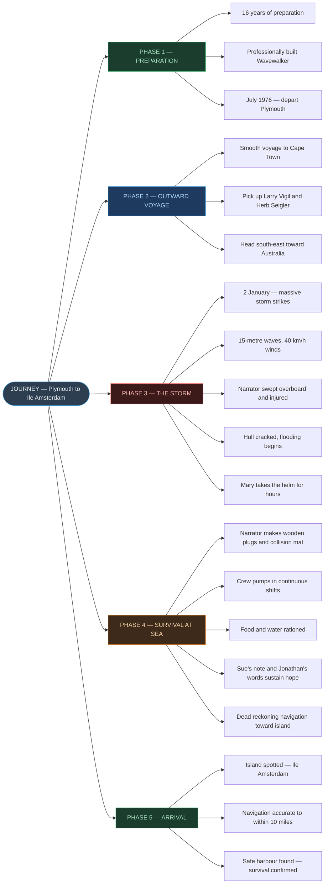
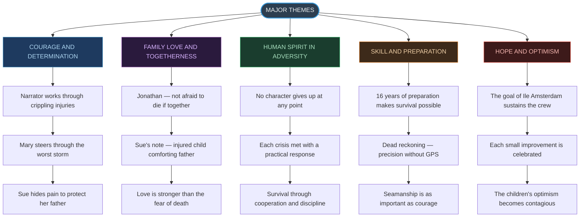
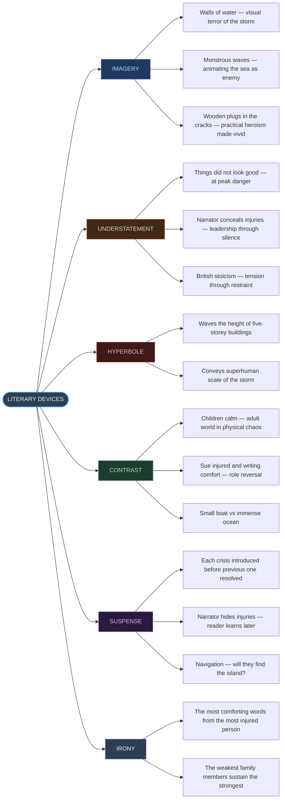
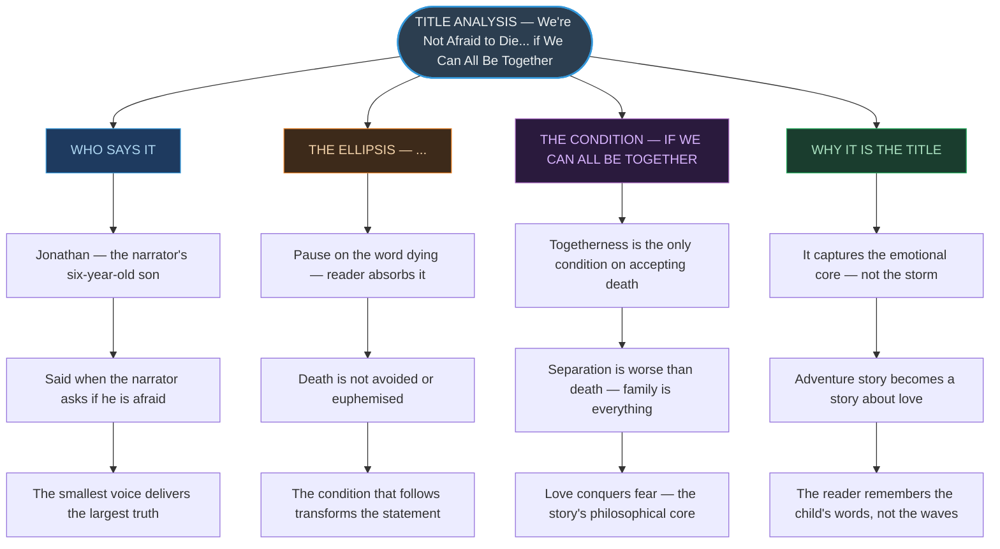

# ⚡ CHAPTER 3 — RAPID REVISION + MIND MAPS
> **We're Not Afraid to Die... if We Can All Be Together** | Board · CUET

---

## 📏 Story Identity — Absolute Must-Memorise

| Feature | Detail | Memory Hook |
|:---|:---:|:---|
| Authors | Gordon Cook and Alan East | *"Cook — like Captain Cook — sailing"* |
| Genre | True adventure narrative | *Real events, real family* |
| Vessel | Wavewalker | *Waves + Walker = it walks through waves* |
| Departure | Plymouth, England — July 1976 | *Plymouth — where Cook himself set out* |
| Storm date | 2 January | *New year, new crisis* |
| Island found | Île Amsterdam | *The destination that saves them* |
| Navigation method | Dead reckoning | *Speed + direction + time = position* |
| Accuracy | Within 10 miles | *Extraordinary precision without GPS* |
| Title source | Jonathan's words (age 6) | *The smallest voice, the biggest truth* |

---

## 🔢 Characters at a Glance ⭐

| Character | Role | Key Contribution | Most Exam-Tested Moment |
|:---:|:---:|:---:|:---:|
| **Narrator (father)** | Captain | Navigation, repair, leadership through injury | Dead reckoning; hiding his own injuries |
| **Mary (wife)** | Crew | Steers through storm; pumps water; emotional anchor | Helmswomanship during the worst storm |
| **Jonathan (son, 6)** | Passenger | Stays cheerful; never cries | *"We're not afraid to die if we can all be together"* |
| **Sue (daughter, 7)** | Passenger | Hides injuries; writes note to father | The note — *"You are the best daddy and best captain"* |
| **Larry and Herb** | Professional crew | Pump water continuously | Physical endurance saving the boat |

> [!warning] Do NOT describe Mary as "just supportive" — she actively steers the boat through the storm for hours. This is a heroic physical act.

---

## 📐 The Journey — Phase by Phase ⭐

| Phase | Period | Location | Key Events |
|:---:|:---:|:---:|:---|
| **Preparation** | 16 years before | England | Planning, building experience, buying Wavewalker |
| **Outward voyage** | July 1976 | Plymouth → Cape Town | Smooth sailing; pick up Larry and Herb |
| **The storm** | 2 January | Southern Indian Ocean | 15-metre waves; flooding; narrator injured; mast damaged |
| **Crisis survival** | Days 2–7 | At sea | Pumping, patching hull, rationing; children's courage |
| **Navigation** | Final days | Southern Indian Ocean | Dead reckoning toward Île Amsterdam |
| **Arrival** | Final day | Île Amsterdam | Island spotted; safe harbour found; survival confirmed |

---

## ⚠️ The Storm — Sequence of Events ⭐

| Event | Significance |
|:---:|:---|
| Massive wave strikes | The beginning of the crisis — nothing can prepare for a 15-metre wave |
| Narrator swept overboard | Near-death moment; he grabs a rope; shows survival instinct |
| Hull cracks; flooding begins | The boat itself is now the enemy |
| Narrator is severely injured | Broken ribs, teeth, face, hands — yet he keeps working |
| Mary takes the helm | She steers alone for hours — quiet heroism |
| Larry and Herb pump | Physical labour that keeps the boat from sinking |
| Mast and rigging cut away | Necessary loss — the mast is a danger, not an asset |
| Narrator makes wooden plugs | Practical genius under pressure — stops the flooding |
| Pumping organised in shifts | The crisis becomes a routine — survival through discipline |

---

## 🔑 Key Quotes — Exam Ready

| Quote | Speaker | Device | What it Means |
|:---|:---:|:---:|:---|
| *"We're not afraid to die, Daddy, if we can all be together."* | Jonathan (6) | Irony, contrast | Love over fear; togetherness as the ultimate value |
| *"Dear Daddy... the best daddy in the world and the best captain."* | Sue (7, note) | Understatement | A seriously injured child reassuring her father — selfless love |
| *"Things didn't look good."* | Narrator | Understatement | At the peak of danger — British stoicism; tension through restraint |
| *"Waves the height of a five-storey building"* | Narrator | Hyperbole | The scale of the storm; beyond normal human experience |
| *"I wanted to hug them both, but I was too filthy and oily."* | Narrator | Contrast | His love contrasted with his physical condition |

---

## ⚡ The Title — Three Layers of Meaning

> [!danger] Title Analysis — Always Appears in Exams
> The title *"We're Not Afraid to Die... if We Can All Be Together"* works on three levels:
>
> **Layer 1 — Literal:** Jonathan, a six-year-old, says this when asked if he is afraid of dying.
>
> **Layer 2 — Thematic:** The condition "if we can all be together" is everything. Death is not the worst outcome — separation is. The story is about a family staying together through the worst the world can throw at them.
>
> **Layer 3 — Structural:** The ellipsis (...) before "if" is deliberate — it pauses on "dying," making the reader absorb that word before the condition transforms it. The "if" is the most important word: death is conditional on togetherness.

---

# 🗺️ MIND MAP 1 — Chapter Overview

```mermaid
flowchart TD
    ROOT(["WE'RE NOT AFRAID TO DIE — Overview"])

    ROOT --> CH["CHARACTERS"]
    ROOT --> PH["JOURNEY PHASES"]
    ROOT --> TH["THEMES"]
    ROOT --> LD["LITERARY DEVICES"]
    ROOT --> EM["EMOTIONAL CLIMAX"]

    CH --> C1["Narrator — captain, navigator, injured hero"]
    CH --> C2["Mary — helmsman, quiet heroism"]
    CH --> C3["Jonathan (6) — cheerful, title quote"]
    CH --> C4["Sue (7) — injured, note to father"]
    CH --> C5["Larry and Herb — professional crew, pumping"]

    PH --> P1["Preparation — 16 years, Plymouth"]
    PH --> P2["Outward voyage — Cape Town, crew pickup"]
    PH --> P3["The storm — Jan 2, 15-metre waves"]
    PH --> P4["Days of crisis — repairs, pumping, navigation"]
    PH --> P5["Arrival — Ile Amsterdam, survival"]

    TH --> T1["Courage and determination"]
    TH --> T2["Family love — togetherness over survival"]
    TH --> T3["Human spirit in adversity"]
    TH --> T4["Hope and skill — dead reckoning triumph"]

    LD --> L1["Understatement — things did not look good"]
    LD --> L2["Imagery — walls of water"]
    LD --> L3["Hyperbole — five-storey waves"]
    LD --> L4["Contrast — children calm, world in chaos"]

    EM --> E1["Jonathan's words — the title"]
    EM --> E2["Sue's note — injured child comforting father"]
    EM --> E3["Discovery of Ile Amsterdam — hope fulfilled"]

    style ROOT fill:#2c3e50,color:#ecf0f1,stroke:#3498db,stroke-width:2px
    style CH fill:#1e3a5f,color:#aed6f1,stroke:#2980b9
    style TH fill:#1a3d2e,color:#a9dfbf,stroke:#27ae60
    style LD fill:#3d2a1a,color:#f0d0a8,stroke:#e67e22
    style EM fill:#2a1a3d,color:#d8b4fe,stroke:#9b59b6
    style PH fill:#3d1a1a,color:#f5b7b1,stroke:#e74c3c
```

---

# 🗺️ MIND MAP 2 — The Journey Phases

---

# 🗺️ MIND MAP 3 — Character Analysis

```mermaid
flowchart TD
    ROOT(["CHARACTER MAP"])

    ROOT --> NAR["NARRATOR — The Father"]
    ROOT --> MAR["MARY — The Wife"]
    ROOT --> JON["JONATHAN — Son, 6 years"]
    ROOT --> SUE["SUE — Daughter, 7 years"]
    ROOT --> CREW["LARRY and HERB — Crew"]

    NAR --> N1["Skilled navigator — 16 years preparation"]
    NAR --> N2["Works through broken ribs and injuries"]
    NAR --> N3["Hides injuries to protect family morale"]
    NAR --> N4["Makes wooden plugs to seal hull"]
    NAR --> N5["Dead reckoning to Ile Amsterdam"]

    MAR --> M1["Steers the boat through the storm for hours"]
    MAR --> M2["Pumps water continuously"]
    MAR --> M3["Never panics — emotional steadiness"]
    MAR --> M4["Silent heroism — understated by narrator"]

    JON --> J1["Never cries despite injury"]
    JON --> J2["Stays cheerful — asks practical questions"]
    JON --> J3["Says the title words — not afraid if together"]
    JON --> J4["Represents innocence and courage combined"]

    SUE --> S1["Black eye, swollen cheek, cracked ribs"]
    SUE --> S2["Hides all injuries from father"]
    SUE --> S3["Writes note — you are the best daddy and captain"]
    SUE --> S4["Draws pictures to cheer narrator"]
    SUE --> S5["Most emotionally significant character"]

    CREW --> CR1["Larry and Herb — picked up in Cape Town"]
    CREW --> CR2["Pump water in exhausting continuous shifts"]
    CREW --> CR3["Professional sailors — physical endurance"]

    style ROOT fill:#2c3e50,color:#ecf0f1,stroke:#3498db,stroke-width:2px
    style NAR fill:#1e3a5f,color:#aed6f1,stroke:#3498db
    style MAR fill:#1a3d2e,color:#a9dfbf,stroke:#27ae60
    style JON fill:#3d2a1a,color:#f0d0a8,stroke:#e67e22
    style SUE fill:#2a1a3d,color:#d8b4fe,stroke:#9b59b6
    style CREW fill:#3d1a1a,color:#f5b7b1,stroke:#e74c3c
```

---

# 🗺️ MIND MAP 4 — Themes Tree

---

# 🗺️ MIND MAP 5 — Literary Devices

---

# 🗺️ MIND MAP 6 — Title Analysis

---

### Quick-Reference Contrast Table

| Aspect | Children (Jonathan + Sue) | Adults (Narrator + Mary) |
|:---:|:---:|:---:|
| **Injuries** | Significant but hidden | Severe; narrator conceals from family |
| **Emotional state** | Cheerful, calm, optimistic | Focused, controlled, professional |
| **Role in story** | The moral and emotional centre | The physical saviours |
| **Type of courage** | Emotional — accepting death with love | Physical — working through pain |
| **What they give others** | Hope and a reason to survive | Safety and leadership |

---

*End of Rapid Revision + Mind Maps — Ch. 3: We're Not Afraid to Die...*
*Exam Tags: CBSE Board · CUET English*
