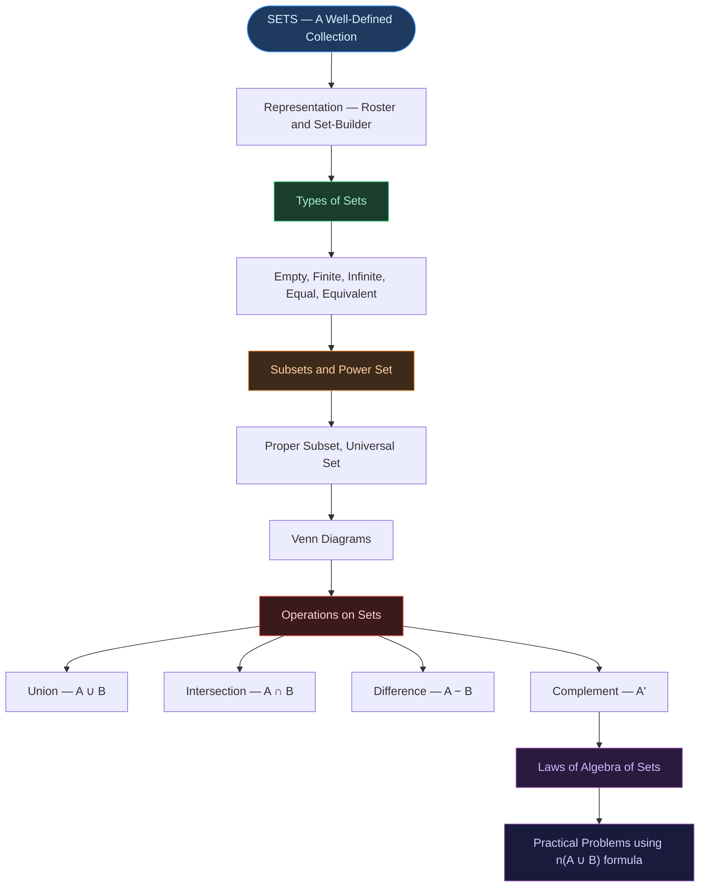

# 📐 CHAPTER 1 — SETS
> **Complete Study Notes** | Board · JEE · CUET Layered
> *Class XI Mathematics — NCERT*

---

## 🗺️ CONCEPT ROADMAP

---

## SECTION 1 — INTRODUCTION TO SETS

### 1.1 What is a Set?

> [!info] Definition
> A **set** is a **well-defined collection of distinct objects**. The objects belonging to a set are called its **elements** or **members**.
>
> $$a \in A \quad \text{means "} a \text{ belongs to set } A\text{"}$$
> $$b \notin A \quad \text{means "} b \text{ does not belong to set } A\text{"}$$

> [!important] Well-Defined — The Key Condition ⭐
> A collection is **well-defined** if, given any object, we can clearly and unambiguously determine whether it belongs to the collection or not.
>
> | Collection | Well-Defined? | Reason |
> |:---|:---:|:---|
> | "All prime numbers less than 10" | ✅ Yes | Precisely determinable: {2, 3, 5, 7} |
> | "All tall students in class" | ❌ No | "Tall" is subjective — no clear criterion |
> | "All vowels in English alphabet" | ✅ Yes | Precisely determinable: {a, e, i, o, u} |
> | "All good books in the library" | ❌ No | "Good" is subjective |

---

### 1.2 Notation

Sets are denoted by **capital letters**: $A, B, C, X, Y, \ldots$

Elements are denoted by **lowercase letters**: $a, b, c, x, y, \ldots$

Some standard sets and their symbols:

| Symbol | Set |
|:---:|:---|
| $\mathbb{N}$ | Natural numbers: $\{1, 2, 3, \ldots\}$ |
| $\mathbb{W}$ | Whole numbers: $\{0, 1, 2, 3, \ldots\}$ |
| $\mathbb{Z}$ | Integers: $\{\ldots, -2, -1, 0, 1, 2, \ldots\}$ |
| $\mathbb{Q}$ | Rational numbers |
| $\mathbb{R}$ | Real numbers |
| $\mathbb{Z}^+$ | Positive integers |

---

## SECTION 2 — REPRESENTATION OF SETS ⭐

### 2.1 Roster (Tabular) Form

> [!note] Roster Form
> All elements are **listed explicitly**, separated by commas, enclosed in **curly braces** { }.
>
> **Rules:**
> - Each element is written **only once** (no repetition)
> - Order does **not** matter
>
> | Set | Roster Form |
> |:---|:---|
> | Vowels in English | $\{a, e, i, o, u\}$ |
> | Even numbers less than 10 | $\{2, 4, 6, 8\}$ |
> | Letters in "SCHOOL" | $\{S, C, H, O, L\}$ |
> | Prime factors of 60 | $\{2, 3, 5\}$ |

> [!warning] Roster Trap
> In the set of letters in "SCHOOL" — O appears twice but is written **only once**. In "MATHEMATICS" → $\{M, A, T, H, E, I, C, S\}$ — each repeated letter written only once.

---

### 2.2 Set-Builder (Rule) Form

> [!note] Set-Builder Form
> Elements are described by a **property or rule** they satisfy.
>
> $$A = \{x : x \text{ satisfies property } P\}$$
> or equivalently
> $$A = \{x \mid x \text{ satisfies property } P\}$$
>
> Read as: *"A is the set of all x such that x satisfies property P"*

| Roster Form | Set-Builder Form |
|:---|:---|
| $\{1, 2, 3, 4, 5\}$ | $\{x : x \in \mathbb{N},\ x \leq 5\}$ |
| $\{2, 4, 6, 8, \ldots\}$ | $\{x : x = 2n,\ n \in \mathbb{N}\}$ |
| $\{-1, 0, 1, 2, 3\}$ | $\{x : x \in \mathbb{Z},\ -1 \leq x \leq 3\}$ |
| $\{1, 4, 9, 16, 25\}$ | $\{x : x = n^2,\ n \in \mathbb{N},\ n \leq 5\}$ |

---

## SECTION 3 — TYPES OF SETS ⭐

### 3.1 Empty Set (Null Set)

> [!important] Empty Set ⭐
> A set with **no elements** is called an **empty set** (or null set or void set).
>
> Denoted by: $\phi$ or $\{\}$
>
> $$n(\phi) = 0$$
>
> **Examples:**
> - $\{x : x \in \mathbb{N},\ x < 1\} = \phi$ (no natural number less than 1)
> - $\{x : x^2 = 4,\ x \text{ is odd}\} = \phi$

> [!warning] Common Error — Board Trap
> $\{\phi\}$ is **NOT** empty — it is a set containing one element (the empty set itself). $\{0\}$ is also **NOT** empty — it contains one element, zero.
>
> Only $\phi$ or $\{\}$ is the empty set.

---

### 3.2 Finite and Infinite Sets

> [!note] Finite vs Infinite
>
> | Type | Definition | Example |
> |:---:|:---|:---|
> | **Finite** | Has a definite (countable) number of elements | $\{1, 2, 3, 4, 5\}$ — $n = 5$ |
> | **Infinite** | Elements cannot be counted or listed completely | $\mathbb{N} = \{1, 2, 3, \ldots\}$ |
>
> The **cardinality** (number of elements) of a finite set $A$ is written $n(A)$.

---

### 3.3 Equal Sets

> [!important] Equal Sets ⭐
> Two sets $A$ and $B$ are **equal** if they contain exactly the **same elements**.
>
> $$A = B \iff \forall\, x:\ (x \in A \Leftrightarrow x \in B)$$
>
> **Order and repetition do not matter:**
> - $\{1, 2, 3\} = \{3, 1, 2\} = \{1, 1, 2, 3\}$ ✅
> - $\{1, 2, 3\} \neq \{1, 2, 4\}$ ❌

---

### 3.4 Equivalent Sets

> [!note] Equivalent Sets
> Two sets are **equivalent** if they have the **same number of elements** (same cardinality) — elements need not be the same.
>
> $$A \sim B \iff n(A) = n(B)$$
>
> **Note:** Equal sets are always equivalent. Equivalent sets are not necessarily equal.
>
> *Example:* $A = \{1, 2, 3\}$ and $B = \{a, b, c\}$ — equivalent but not equal.

---

### 3.5 Singleton Set

> [!note] Singleton Set
> A set with exactly **one element**.
>
> *Example:* $\{5\}$, $\{\phi\}$, $\{0\}$

---

## SECTION 4 — SUBSETS ⭐

### 4.1 Definition of Subset

> [!important] Subset Definition ⭐
> Set $A$ is a **subset** of set $B$ if every element of $A$ is also an element of $B$.
>
> $$A \subseteq B \iff \forall\, x:\ (x \in A \Rightarrow x \in B)$$
>
> Read as: *"A is a subset of B"* or *"A is contained in B"*
>
> $A \not\subseteq B$ means $A$ is **not** a subset of $B$ — there exists at least one element in $A$ that is not in $B$.

> [!tip] Key Facts About Subsets
> - The **empty set** $\phi$ is a subset of **every** set: $\phi \subseteq A$ for all $A$
> - Every set is a subset of **itself**: $A \subseteq A$ for all $A$
> - If $A \subseteq B$ and $B \subseteq A$, then $A = B$

---

### 4.2 Proper Subset

> [!note] Proper Subset
> $A$ is a **proper subset** of $B$ if $A \subseteq B$ and $A \neq B$ — i.e., $B$ has at least one element not in $A$.
>
> $$A \subset B$$

| Relationship | Symbol | Meaning |
|:---:|:---:|:---|
| Subset | $A \subseteq B$ | Every element of $A$ is in $B$ (equal allowed) |
| Proper subset | $A \subset B$ | Every element of $A$ is in $B$, but $A \neq B$ |
| Superset | $B \supseteq A$ | $B$ contains all elements of $A$ |

---

### 4.3 Power Set ⭐

> [!important] Power Set ⭐
> The **power set** of a set $A$ is the set of **all subsets** of $A$, including $\phi$ and $A$ itself.
>
> $$P(A) = \{S : S \subseteq A\}$$
>
> **Cardinality formula:**
> $$\text{If } n(A) = n \text{, then } n(P(A)) = 2^n$$

> [!example] Power Set Example
> Let $A = \{1, 2, 3\}$, so $n(A) = 3$.
>
> $$P(A) = \{\phi,\ \{1\},\ \{2\},\ \{3\},\ \{1,2\},\ \{1,3\},\ \{2,3\},\ \{1,2,3\}\}$$
>
> $n(P(A)) = 2^3 = 8$ ✓
>
> Number of proper subsets $= 2^n - 1 = 7$

| $n(A)$ | $n(P(A)) = 2^n$ | Proper subsets $= 2^n - 1$ |
|:---:|:---:|:---:|
| 0 | 1 | 0 |
| 1 | 2 | 1 |
| 2 | 4 | 3 |
| 3 | 8 | 7 |
| 4 | 16 | 15 |
| $n$ | $2^n$ | $2^n - 1$ |

---

### 4.4 Universal Set

> [!note] Universal Set
> A set that contains **all elements** under consideration in a given context. Denoted by $U$ or $\xi$.
>
> All other sets in the discussion are subsets of the universal set.
>
> *Example:* If we are discussing sets of digits, $U = \{0, 1, 2, 3, 4, 5, 6, 7, 8, 9\}$

---

## SECTION 5 — VENN DIAGRAMS

> [!info] Venn Diagrams
> Diagrams using overlapping circles or regions within a rectangle to represent sets and their relationships. The rectangle represents the universal set $U$.
>
> - Circles represent individual sets
> - Overlapping regions represent elements common to both sets
> - Non-overlapping regions represent elements in one set only

---

## SECTION 6 — OPERATIONS ON SETS ⭐

### 6.1 Union of Sets

> [!important] Union — $A \cup B$ ⭐
> The union of sets $A$ and $B$ is the set of **all elements that belong to $A$ or $B$ or both**.
>
> $$A \cup B = \{x : x \in A \text{ or } x \in B\}$$
>
> **Properties of Union:**
>
> | Property | Statement |
> |:---|:---|
> | Commutative | $A \cup B = B \cup A$ |
> | Associative | $(A \cup B) \cup C = A \cup (B \cup C)$ |
> | Identity | $A \cup \phi = A$ |
> | Idempotent | $A \cup A = A$ |
> | Universal | $A \cup U = U$ |

> [!example] Union Example
> $A = \{1, 2, 3, 4\}$, $B = \{3, 4, 5, 6\}$
>
> $A \cup B = \{1, 2, 3, 4, 5, 6\}$

---

### 6.2 Intersection of Sets

> [!important] Intersection — $A \cap B$ ⭐
> The intersection of sets $A$ and $B$ is the set of **all elements common to both $A$ and $B$**.
>
> $$A \cap B = \{x : x \in A \text{ and } x \in B\}$$
>
> **Properties of Intersection:**
>
> | Property | Statement |
> |:---|:---|
> | Commutative | $A \cap B = B \cap A$ |
> | Associative | $(A \cap B) \cap C = A \cap (B \cap C)$ |
> | Identity | $A \cap U = A$ |
> | Idempotent | $A \cap A = A$ |
> | Null | $A \cap \phi = \phi$ |

> [!example] Intersection Example
> $A = \{1, 2, 3, 4\}$, $B = \{3, 4, 5, 6\}$
>
> $A \cap B = \{3, 4\}$

---

### 6.3 Disjoint Sets

> [!note] Disjoint Sets
> Two sets $A$ and $B$ are **disjoint** if they have no common elements:
>
> $$A \cap B = \phi$$

---

### 6.4 Difference of Sets

> [!important] Difference — $A - B$ ⭐
> The difference $A - B$ is the set of elements that **belong to $A$ but not to $B$**.
>
> $$A - B = \{x : x \in A \text{ and } x \notin B\}$$
>
> **Note:** $A - B \neq B - A$ in general (difference is NOT commutative)

> [!example] Difference Example
> $A = \{1, 2, 3, 4\}$, $B = \{3, 4, 5, 6\}$
>
> $A - B = \{1, 2\}$ (in $A$, not in $B$)
>
> $B - A = \{5, 6\}$ (in $B$, not in $A$)

---

### 6.5 Complement of a Set

> [!important] Complement — $A'$ or $A^c$ ⭐
> The complement of set $A$ with respect to universal set $U$ is the set of all elements of $U$ that are **not in $A$**.
>
> $$A' = U - A = \{x : x \in U \text{ and } x \notin A\}$$
>
> **Properties of Complement:**
>
> | Property | Statement |
> |:---|:---|
> | Complement laws | $A \cup A' = U$ |
> | | $A \cap A' = \phi$ |
> | Double complement | $(A')' = A$ |
> | Empty set complement | $\phi' = U$ |
> | Universal set complement | $U' = \phi$ |

---

## SECTION 7 — LAWS OF ALGEBRA OF SETS ⭐

### 7.1 De Morgan's Laws ⭐⭐

> [!important] De Morgan's Laws — Must Know ⭐⭐
>
> $$\boxed{(A \cup B)' = A' \cap B'}$$
>
> $$\boxed{(A \cap B)' = A' \cup B'}$$
>
> **In words:**
> - The complement of a union = intersection of complements
> - The complement of an intersection = union of complements

---

### 7.2 Distributive Laws

> [!important] Distributive Laws ⭐
>
> $$A \cup (B \cap C) = (A \cup B) \cap (A \cup C)$$
>
> $$A \cap (B \cup C) = (A \cap B) \cup (A \cap C)$$

---

### 7.3 Complete Laws Table

| Law | Union Form | Intersection Form |
|:---|:---|:---|
| **Idempotent** | $A \cup A = A$ | $A \cap A = A$ |
| **Identity** | $A \cup \phi = A$ | $A \cap U = A$ |
| **Commutative** | $A \cup B = B \cup A$ | $A \cap B = B \cap A$ |
| **Associative** | $(A \cup B) \cup C = A \cup (B \cup C)$ | $(A \cap B) \cap C = A \cap (B \cap C)$ |
| **Distributive** | $A \cup (B \cap C) = (A \cup B) \cap (A \cup C)$ | $A \cap (B \cup C) = (A \cap B) \cup (A \cap C)$ |
| **De Morgan's** | $(A \cup B)' = A' \cap B'$ | $(A \cap B)' = A' \cup B'$ |
| **Complement** | $A \cup A' = U$ | $A \cap A' = \phi$ |
| **Double complement** | $(A')' = A$ | — |
| **Absorption** | $A \cup (A \cap B) = A$ | $A \cap (A \cup B) = A$ |

---

## SECTION 8 — PRACTICAL PROBLEMS: CARDINALITY FORMULA ⭐⭐

### 8.1 The Fundamental Formula

> [!important] Union Cardinality Formula ⭐⭐
>
> $$\boxed{n(A \cup B) = n(A) + n(B) - n(A \cap B)}$$
>
> This is the most important formula in the chapter for practical problems.
>
> **When $A$ and $B$ are disjoint** ($A \cap B = \phi$):
>
> $$n(A \cup B) = n(A) + n(B)$$

---

### 8.2 Formula for Three Sets

> [!important] Three-Set Formula ⭐
>
> $$\boxed{n(A \cup B \cup C) = n(A) + n(B) + n(C) - n(A \cap B) - n(B \cap C) - n(A \cap C) + n(A \cap B \cap C)}$$

---

### 8.3 Worked Examples ⭐

> [!example] Example 1 — Two Sets
> In a class of 40 students, 25 play cricket and 20 play football. If 10 play both, how many play at least one sport?
>
> $n(C) = 25$, $n(F) = 20$, $n(C \cap F) = 10$
>
> $$n(C \cup F) = 25 + 20 - 10 = \boxed{35}$$

> [!example] Example 2 — Finding Intersection
> In a group of 70 people, 37 like coffee and 52 like tea. How many like both?
>
> $n(C \cup T) \leq 70$, $n(C) = 37$, $n(T) = 52$
>
> $$n(C \cup T) = 37 + 52 - n(C \cap T) \leq 70$$
>
> $$n(C \cap T) \geq 37 + 52 - 70 = \boxed{19}$$

> [!example] Example 3 — Three Sets (Typical Board Problem)
> In a survey of 60 people: 25 read newspaper A, 26 read B, 26 read C. 9 read both A and B, 11 read both B and C, 8 read both A and C, 3 read all three. Find those who read at least one.
>
> $$n(A \cup B \cup C) = 25 + 26 + 26 - 9 - 11 - 8 + 3 = \boxed{52}$$

---

## SECTION 9 — INTERVAL NOTATION (Extension for JEE)

> [!note] Intervals as Sets
>
> | Notation | Meaning | Set-Builder |
> |:---:|:---|:---|
> | $(a, b)$ | Open interval | $\{x : a < x < b\}$ |
> | $[a, b]$ | Closed interval | $\{x : a \leq x \leq b\}$ |
> | $(a, b]$ | Half-open | $\{x : a < x \leq b\}$ |
> | $[a, b)$ | Half-open | $\{x : a \leq x < b\}$ |
> | $(a, \infty)$ | Open ray | $\{x : x > a\}$ |
> | $(-\infty, b]$ | Closed ray | $\{x : x \leq b\}$ |

---

## QUICK FORMULA REFERENCE

| Concept | Formula / Fact |
|:---|:---|
| Power set cardinality | $n(P(A)) = 2^{n(A)}$ |
| Number of proper subsets | $2^n - 1$ |
| Union of two sets | $n(A \cup B) = n(A) + n(B) - n(A \cap B)$ |
| Disjoint union | $n(A \cup B) = n(A) + n(B)$ |
| Three-set union | $n(A \cup B \cup C) = n(A)+n(B)+n(C)-n(A \cap B)-n(B \cap C)-n(A \cap C)+n(A \cap B \cap C)$ |
| Complement | $A' = U - A$ |
| Double complement | $(A')' = A$ |
| De Morgan's 1 | $(A \cup B)' = A' \cap B'$ |
| De Morgan's 2 | $(A \cap B)' = A' \cup B'$ |
| Empty set | $\phi \subseteq A$ for all $A$ |
| Self-subset | $A \subseteq A$ for all $A$ |
| Complement union | $A \cup A' = U$ |
| Complement intersection | $A \cap A' = \phi$ |

---

*End of Core Notes — Ch. 1: Sets*
*Exam Tags: CBSE Board · JEE Mains · CUET Mathematics*
