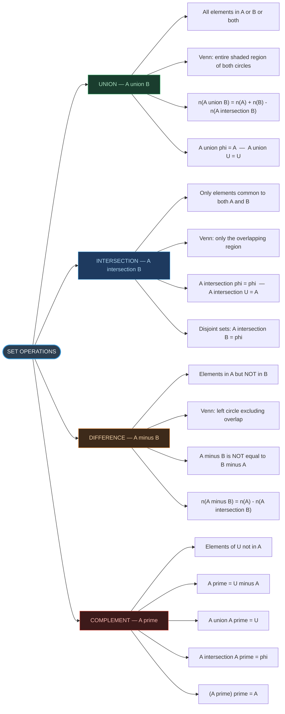
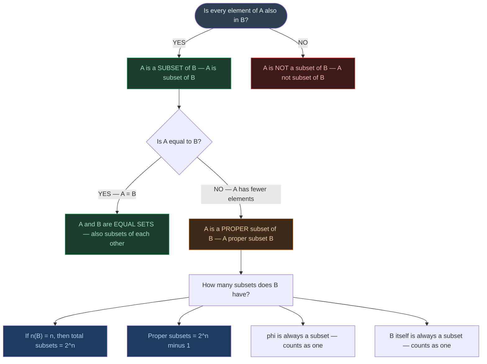
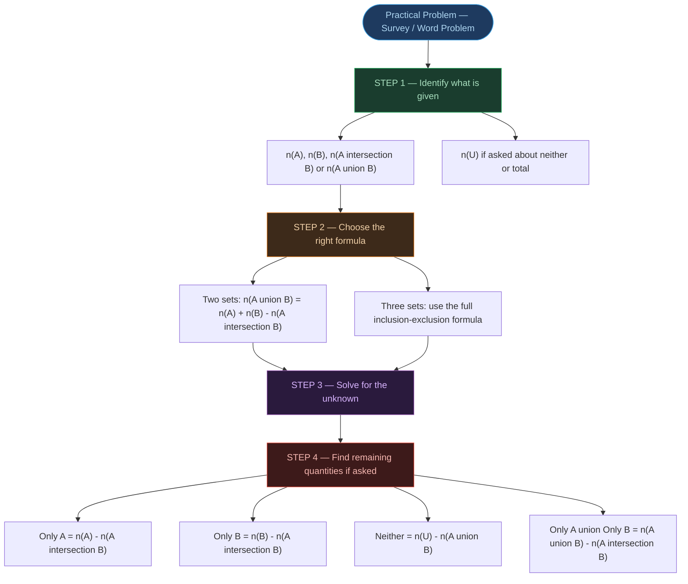
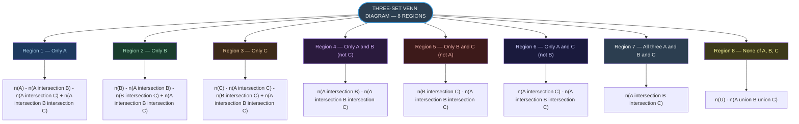

# ⚡ CHAPTER 1 — RAPID REVISION + MIND MAPS
> **Sets** | Board · JEE · CUET

---

## 📏 Core Definitions — Absolute Must-Memorise

| Term | Definition | Key Symbol |
|:---|:---|:---:|
| Set | Well-defined collection of distinct objects | $\{ \}$ |
| Element | An object belonging to a set | $\in$ / $\notin$ |
| Empty set | A set with no elements | $\phi$ |
| Subset | Every element of $A$ is in $B$ | $A \subseteq B$ |
| Proper subset | $A \subseteq B$ and $A \neq B$ | $A \subset B$ |
| Power set | Set of all subsets of $A$ | $P(A)$ |
| Universal set | Set containing all elements under consideration | $U$ |
| Complement | Elements of $U$ not in $A$ | $A'$ |

---

## 🔢 Cardinality Formulae — Know Cold ⭐⭐

| Formula | Statement | When to Use |
|:---|:---:|:---|
| Power set | $n(P(A)) = 2^{n(A)}$ | Finding number of subsets |
| Two-set union | $n(A \cup B) = n(A) + n(B) - n(A \cap B)$ | Practical counting problems |
| Disjoint sets | $n(A \cup B) = n(A) + n(B)$ | When $A \cap B = \phi$ |
| Three-set union | $n(A \cup B \cup C) = n(A)+n(B)+n(C)-n(A \cap B)-n(B \cap C)-n(A \cap C)+n(A \cap B \cap C)$ | Survey problems |
| Only in A | $n(A) - n(A \cap B)$ | Venn diagram regions |
| Neither | $n(U) - n(A \cup B)$ | Elements in none |

> [!warning] Three-Set Formula — Sign Pattern
> **Add** individual sets → **Subtract** pairwise intersections → **Add back** triple intersection
> The alternating +/− pattern is the most common source of error in board and JEE problems.

---

## 📐 De Morgan's Laws — Critical ⭐⭐

> [!important] De Morgan's Laws — These Appear Every Year
>
> $$\boxed{(A \cup B)' = A' \cap B'}$$
>
> $$\boxed{(A \cap B)' = A' \cup B'}$$
>
> **Memory hook:** When you take the complement, **flip** $\cup$ to $\cap$ (and vice versa), and complement each set.

---

## ⚠️ Types of Sets — Quick Reference

| Type | Condition | Example |
|:---:|:---:|:---|
| **Empty** | $n(A) = 0$ | $\phi = \{\}$ |
| **Singleton** | $n(A) = 1$ | $\{0\}$, $\{\pi\}$ |
| **Finite** | $n(A) = $ countable number | $\{1, 2, 3, 4, 5\}$ |
| **Infinite** | Elements cannot be counted | $\mathbb{N}, \mathbb{Z}, \mathbb{R}$ |
| **Equal** | Same elements | $\{1,2\} = \{2,1\}$ |
| **Equivalent** | Same cardinality | $\{1,2,3\} \sim \{a,b,c\}$ |
| **Disjoint** | $A \cap B = \phi$ | No common elements |
| **Universal** | Contains all elements | $U$ |

> [!danger] 3 Traps That Cost Marks
> 1. $\{\phi\}$ is **NOT** empty — it contains one element ($\phi$ itself); $n(\{\phi\}) = 1$
> 2. $\{0\}$ is **NOT** empty — it contains one element (zero); $n(\{0\}) = 1$
> 3. Equal sets $\Rightarrow$ equivalent, but equivalent sets $\not\Rightarrow$ equal

---

## 🔑 Properties of Operations — All at Once

| Property | $\cup$ (Union) | $\cap$ (Intersection) |
|:---:|:---:|:---:|
| Commutative | $A \cup B = B \cup A$ | $A \cap B = B \cap A$ |
| Associative | $(A \cup B) \cup C = A \cup (B \cup C)$ | $(A \cap B) \cap C = A \cap (B \cap C)$ |
| Identity element | $A \cup \phi = A$ | $A \cap U = A$ |
| Zero/Universal | $A \cup U = U$ | $A \cap \phi = \phi$ |
| Idempotent | $A \cup A = A$ | $A \cap A = A$ |
| Complement | $A \cup A' = U$ | $A \cap A' = \phi$ |
| Absorption | $A \cup (A \cap B) = A$ | $A \cap (A \cup B) = A$ |

---

## ⚡ Power Set — Quick Reference

| $n(A)$ | $n(P(A))$ | List of all subsets |
|:---:|:---:|:---|
| 0 | 1 | $\{\phi\}$ |
| 1 | 2 | $\phi, \{a\}$ |
| 2 | 4 | $\phi, \{a\}, \{b\}, \{a,b\}$ |
| 3 | 8 | $\phi$, three singletons, three pairs, full set |
| $n$ | $2^n$ | All $2^n$ subsets |

---

# 🗺️ MIND MAP 1 — Chapter Overview

```mermaid
flowchart TD
    ROOT(["SETS — Chapter 1"])

    ROOT --> REP["REPRESENTATION"]
    ROOT --> TYP["TYPES OF SETS"]
    ROOT --> SUB["SUBSETS"]
    ROOT --> OPS["OPERATIONS"]
    ROOT --> LAW["LAWS"]
    ROOT --> FOR["FORMULAE"]

    REP --> R1["Roster — list all elements"]
    REP --> R2["Set-builder — describe by rule"]

    TYP --> T1["Empty — phi — n = 0"]
    TYP --> T2["Finite — countable n"]
    TYP --> T3["Infinite — uncountable"]
    TYP --> T4["Equal — same elements"]
    TYP --> T5["Equivalent — same n(A)"]
    TYP --> T6["Singleton — n = 1"]

    SUB --> S1["Subset — A is subset of B — all elements of A in B"]
    SUB --> S2["Proper subset — A is proper subset B — A not equal B"]
    SUB --> S3["Power set — all subsets — n(P(A)) = 2^n"]
    SUB --> S4["Universal set — U contains all"]

    OPS --> O1["Union — A union B — or"]
    OPS --> O2["Intersection — A intersection B — and"]
    OPS --> O3["Difference — A minus B — in A not in B"]
    OPS --> O4["Complement — A prime = U minus A"]

    LAW --> L1["Commutative — order does not matter"]
    LAW --> L2["Associative — grouping does not matter"]
    LAW --> L3["Distributive — union over intersection"]
    LAW --> L4["De Morgan — complement flips the operation"]

    FOR --> F1["n(A union B) = n(A) + n(B) - n(A intersection B)"]
    FOR --> F2["n(P(A)) = 2^n"]
    FOR --> F3["Three set formula — add subtract add pattern"]

    style ROOT fill:#2c3e50,color:#ecf0f1,stroke:#3498db,stroke-width:2px
    style REP fill:#1e3a5f,color:#aed6f1,stroke:#2980b9
    style TYP fill:#1a3d2e,color:#a9dfbf,stroke:#27ae60
    style SUB fill:#3d2a1a,color:#f0d0a8,stroke:#e67e22
    style OPS fill:#3d1a1a,color:#f5b7b1,stroke:#e74c3c
    style LAW fill:#2a1a3d,color:#d8b4fe,stroke:#9b59b6
    style FOR fill:#1a1a3d,color:#d0d0ff,stroke:#9b59b6
```

---

# 🗺️ MIND MAP 2 — Set Operations (with Venn regions)

---

# 🗺️ MIND MAP 3 — Subsets and Power Set Decision Tree

---

# 🗺️ MIND MAP 4 — De Morgan's Laws and Complement Laws

```mermaid
flowchart TD
    ROOT(["COMPLEMENT LAWS — KEY RESULTS"])

    ROOT --> DM["DE MORGAN'S LAWS"]
    ROOT --> CL["BASIC COMPLEMENT LAWS"]
    ROOT --> DC["DOUBLE COMPLEMENT"]

    DM --> DM1["(A union B) prime = A prime intersection B prime"]
    DM --> DM2["(A intersection B) prime = A prime union B prime"]
    DM --> DM3["RULE: Complement flips union to intersection and vice versa"]
    DM --> DM4["Each individual set also gets complemented"]

    CL --> C1["A union A prime = U — everything"]
    CL --> C2["A intersection A prime = phi — nothing in common"]
    CL --> C3["U prime = phi"]
    CL --> C4["phi prime = U"]

    DC --> DC1["(A prime) prime = A"]
    DC --> DC2["Complement twice returns original set"]

    ROOT --> ABS["ABSORPTION LAWS"]
    ABS --> A1["A union (A intersection B) = A"]
    ABS --> A2["A intersection (A union B) = A"]

    style ROOT fill:#2c3e50,color:#ecf0f1,stroke:#3498db,stroke-width:2px
    style DM fill:#2a1a3d,color:#d8b4fe,stroke:#9b59b6
    style CL fill:#1a3d2e,color:#a9dfbf,stroke:#27ae60
    style DC fill:#1e3a5f,color:#aed6f1,stroke:#3498db
    style ABS fill:#3d2a1a,color:#f0d0a8,stroke:#e67e22
    style DM1 fill:#3d1a1a,color:#f5b7b1,stroke:#e74c3c
    style DM2 fill:#3d1a1a,color:#f5b7b1,stroke:#e74c3c
```

---

# 🗺️ MIND MAP 5 — Practical Problem Strategy

---

# 🗺️ MIND MAP 6 — Three-Set Venn Diagram Regions

---

### Quick-Reference Contrast Table

| Feature | Roster Form | Set-Builder Form |
|:---:|:---:|:---:|
| **Method** | List all elements | Describe by property |
| **Best for** | Small, finite sets | Large, infinite, or rule-defined sets |
| **Example** | $\{2, 4, 6, 8\}$ | $\{x : x = 2n, n \in \mathbb{N}, n \leq 4\}$ |
| **Notation** | Curly braces, commas | $\{x : \text{property}\}$ |
| **Repeated elements** | Written only once | Property handles uniqueness |

---

*End of Rapid Revision + Mind Maps — Ch. 1: Sets*
*Exam Tags: CBSE Board · JEE Mains · CUET Mathematics*
